# 攻略（半更新成品）

::: info 来源说明
本页由上传的攻略文档 `攻略（半更新成品）.docx` 自动转换为 Markdown。图片已提取到站点资源目录；如发现排版错位，建议在本页基础上人工校对。
:::

1.  目录

<!-- -->

1.  萌新问题：p2-p4（包括朱红大部分问题）

2.  武士甲系列问题：p5

3.  技能点更新（本mod）：p6

4.  NPC：p7-p9

5.  称号问题（囊括所有称号，包括五印）：p10-p11

6.  陨铁武器个人评价（注意是个人）：p12-p18

7.  公主攻略：p19-p21

8.  亡灵攻略（包含亡灵大部分前期打法）：p22-p24

9.  圣女攻略：p25

10. bug利用：p26

11. 开箱子方法：p27-p29

12. 作弊须知：p30

13. 村战地形利用：p31-p32

14. 魔兽养成方案与开厂问题：p33

15. 杀马特与金蛇寻找方案：p34-p36（包括各箱子内物品）

16. 各国兵种大概介绍：p37

17. 如何卖NPC：p38

18. 后记（包括个人加点问题、神器问题）：p39

19. 关于特殊武器怎么获得（包括：杀马特·云戈，龙矛·冷锋，龙盾·冷面，同时，无法获得的神器会提及。。）：p40

    额外备注：商人版本目前bug较多且正在测试，还是希望大家如果有精力测试一下，这个目前我就不写了，只在第四页提及了一下万花之主，等到正式成品出来我就认真另起一页写商人玩法，谢谢大家谅解

<!-- -->

2.  关于朱红的萌新问题

<!-- -->

1.  （亡灵档）母体：这是亡灵档的核心，同时也是亡灵档玩起来的快乐之处，你可以利用你的小兵提升自己的母体等级，也可以降一级提升不死族所有领主关系，母体30级并且做完武士甲任务可以挑战夜莺中队（猝死警告与废档警告），45级墓地可以刷出恐怖军团（帮助你守护村子）；每十级获得一个暴君种子（给NPC则将NPC智力削为0，技能点也相应降低，但是智力会分散到力量与敏捷上，同时该NPC受母体增益更高）。本modNPC＋几位国王里面除了辣条均无法感染（包括五匪首在内，因此不要想什么感染公主之类的事情）

2.  （公主档）杀师还是不杀师：这是公主档最大的分支，它决定了你的两种路，如果你是直面流你只能打一种（能修改代码、复制存档的当我没说）；不直面的可以双选。

    主要差距：杀师后师徒四人死亡，获得免费城堡德其欧斯堡（没有驻军），同时颜君入队，三大会战全部失利，公主会跳崖，三啸剧情会开启（简单来说杀师档剧情比不杀师长且难）

    不杀师可以获得可换装的师徒四人，德其欧斯堡会有95守军（在杀师中由朱坤带领来打你），颜君不会入队，三大会战胜利，有领主带着城池投靠你，不死族剧情可以让大师兄单挑龙玉获得魂之·挽歌

3.  杀师：这是朱红公主主线剧情，你将依次杀掉大师兄，三师兄，要离，获得冷血性格，孝悌忠信的性格废除（这两种性格对应能力下面有），一周后杀掉二师兄，后面的剧情会变长，同时会出现作者本人：三啸；

4.  不杀师：这是非主线剧情，短得多，简单得多，获得称号：义深情重（无效果，但是是后期法师任务必备，法师支线任务只有不杀师才能完成全部升级），三啸出现但雨女无瓜。

5.  陨铁：这是朱红的特色之一，是你战场上杀敌时累积陨铁碎片，积攒到一定数量可兑换成陨铁的一种算法，陨铁可以升级武器、马匹、盔甲；同时也可以打造武器，多个陨铁打造成一套盔甲，并升级骏马和猎马为光明战马和黑暗战马（请不要升级你的弹药筒）

    6、问题：1、魂之·挽歌在当下版本只有大师兄和龙玉、魂之誓约三人使用挽歌有顺势斩；2、关于公主开局问题：公主开局只能带八个人，到你做完师傅系列任务（杀完师成为领主后）恢复正常带兵数，同时记住雇佣军不占格子但是工资量会随着同一种佣兵的增加而增加。3、统领技能：系统会根据你的战斗方式（步战步射骑射骑战）分别增加你的对应的统领等级，对应的等级能给对应的兵种（如英雄等级给NPC增加）增加相应的攻击力防御力之类（具体可以在报告中的个人信息查看）

    7、蒙古问题

    公主档：解决完黛安娜后出现（没事不要灭国库吉特，留两座城市免得出事，杀师档暗黑特工队最好也选诺德和维吉亚免得问题大，此时维吉亚和诺德基本在和丝袜开干）

    亡灵档：（龙玉入队后达到一定时间自动出来）

    8、四国之乱：这是目前公主版本的终点（有始无终），四国的部队都是最精英的（维吉亚——海外征服者（火枪体系求你锤死我）；诺德——尸化（双倍血量你快乐了吗），全部变成丧尸；罗多克——邪教大军（猎马者），萨兰德——驯兽师（感受到魔兽的快乐了吗）

    9、关于东瀛士兵：东瀛士兵是目前正在考虑的一个剧情，群里想象力丰富点的群员也帮忙想一下早点帮助三啸赶出来我们也好玩

    10、关于AI：咖啡同意给了三啸部分AI：（加强了射手AI 骑兵AI 骑射AI，骑射AI还有君悦大大的备用AI）因此当下版本AI智商变高，高难度选择请谨慎

    11、贴身兵种系列：人类NPC点统御技能，会招募对应的贴身部队，贴身部队步战/骑马取决于招募他的NPC，而能力值也会增强（和魔兽一样死了只要对应的NPC不死就可以下一局刷新）

    12、另外，NPC与士兵的能力值受到营养系统的影响：（所以你的铁骨和强击下降记得看看是不是没吃的了？）

    

    13、最大血量上限：NPC每级获得20％额外血量，而主角则每做一个任务获得1％额外血量上限（可和科技叠加，主角本人拿不到血牛）

14、科技：

15、兵种特色：掠夺能力：杀人得钱，得到的数量与自己的掠夺等级成正比

铁臂：初始10％免伤，每级1％免伤能力，可与铁骨叠加

血牛：兵种双倍血量

疾风之舞、血盾、魅眼：不变

18、杀人涨属性：NPC与主角杀一定数量的敌人就能4种属性各涨1点，杀人数与智力成反比（具体算法：玩家的量：第一次是（力敏魅三者的和-智力＋30）×1.5＋100（商人档第一次为150，即最低150）；此后每一级都是（上一级杀人数＋力敏魅-智力）x1.5＋100；NPC的量：第一次是（力敏魅三者的和➖智力＋30）×1.2；此后每一级都是（上一级杀人数＋力敏魅-智力）x1.2＋30（其实具体多少不用自己去算，你只需要知道加智力可以减免杀敌涨属性即可）

19、守城新特色：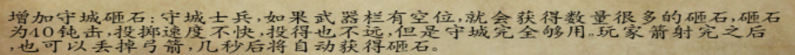

20、特殊兵种的招募方法：（1）、卡拉德黄金女将与光明系军种：玩家为卡拉德的领主，在获得城镇/城市的封地后建造训练场/学校然后升级，可以利用城堡提供的招兵点升级对应军种为这两种军队。

2.  、黑暗军种：公主杀师可以在完成黛安娜剧情后找三啸用丝袜皇家骑士升级为黑暗骑士，比例为1：1；不杀师则有暗灵石（战场自动提供）

3.  、蒙古军种：问阿喇海别可以招募（在阿喇海别入队后和黄金女将一个招法）

4.  、卡洛斯军种：公主招募三啸三杰（哼哈、玛雅、奥尔克）的最高级军种后在自己城堡招募（和黄金女将一个招法）

5.  、驯兽师、罗多克邪教军队：俘虏招募

6.  、海外征服者：可通过俘虏招募（但当下这类兵种会定期自动清理，因此能在清理之前招募到算你的运气）

7.  、宗师格斗家合成方法：  
    你先有一个红袍格斗家  
    然后去打红袍竞技场  
    你打败10个人可以提升一个红袍至宗师提名者（升级得宗师格斗家）  
    你打败15个人可以提升三个红袍至宗师提名者（升级得宗师格斗家）  
    以此类推，20-----五个  
    你活到最后可以提升十个红袍至宗师提名者（升级得宗师格斗家）

    21、朱红的火枪：只有一把你可以用，火枪燃烬，20级时在营地扎营有选项，（异国商人提问）答案附图：（请数字数）

22、敌人的科技：（一般而言，难度越高科技升级越快，且敌人科技点无上限）  
（敌人升一级科技时间对应  
三神模式       9.375天——准备好你的肝  
天神模式       12   天  
地狱模式       18.75天  
恶梦模式       37.5 天  
正常模式       75   天  ）

23. 关于商人万花之主：

    这个，设计是不错的，自带后宫亲卫，可以换装的士兵，类似且好于潘德的骑士团，但是，刚做出来，充斥着过多的bug且系统设置并不完善，所以，测试一下就好，如果有什么bug，直接截图私信发给我或者三啸都行。（个人QQ：445332661，B站uid：351227661）

    后宫亲卫特性：工资与装备成正比，可以自己换装，可以找切娜升级一次（五种选择

    武士甲系列任务：

<!-- -->

1.  在地图上找到战团三宝箱里面的武士甲（分别在杰尔喀拉的马匹贩子旁边稻草堆里、提哈的船上、日瓦车则拐角的稻草堆里）

2.  集齐六件装备（盔甲头盔靴子三刀）后去找乱葬岗的村长守墓老头，可以用旧装备六件换一套27力量才能用的精英武士套（盔甲头盔靴子三刀都是27力量）

3.  如果你是亡灵，则你可以在30级母体（不是你的等级）的时候在晚上去乱葬岗，开启夜莺中队选项，带上你的NPC打24个夜莺＋守墓老头，胜利可获得三刃（长刃·村雨、战刃·止水与短刃·雪妖三把刀，伤害是27力量套伤害的砍伤转变为刺伤）＋13夜莺武士（战斗中死了战斗后会自动补充），失败直接退回到主界面

4.  如果你是公主，到了任务一定时候可以进入乱葬岗打夜莺中队（此时老头加入你的队伍打夜莺，但请注意不是给你老头NPC），胜利后获得病原体（自行处理）

    5、请不要怪我没提醒你，亡灵母体正好30级时，你一般是打不赢夜莺的

    请不要卖掉战团三宝箱里面的武士甲，不然做不了夜莺任务再来问小心被我骂死

    本mod技能点的更新：

<!-- -->

1.  合并强击和强掷：只要升级强击便可使用标枪（商店里那些标枪的强掷自动看作强击，给NPC点后在大地图上隔一段时间才生效）

2.  铁骨增加免伤：点铁骨会有免伤加成，免伤的程度随着铁骨等级的增加而增加（奥尔克军种可以与其技能叠加）

3.  武器掌握增加暴击率：点武器掌握可以获得暴击率，暴击率获得的多少随武器掌握的点数的增加而增加，可与其它技能叠加

4.  增加新技能：格挡：格挡可以有几率抵消一部分伤害，抵消伤害的量与几率随着格挡等级的增加而增加，格挡等级高后可以把敌人对你的暴击伤害转化为普通伤害，致命伤害转化为暴击伤害，并且可以与格斗家共同加成

5.  改跑动为步战：除原跑动的收益以外，增加步战与步射时的暴击率与格挡率

6.  改工程学为机械学，上限改为15级（15级是云梯0小时制作，攻城车在一天内就可制作）

7.  增加统御新能力：人类NPC点统御可以招募贴身部队，贴身兵种（乡勇、伍长、百夫长、副将）与数量随着统御等级的增加而增加。贴身部队起码与否取决于NPC本身，NPC骑马就骑马，NPC步战就步战（本人点统御无贴身）；统御技能可以增加科技点与招兵点

8.  增加掠夺新能力：点了掠夺点的兵种（包括NPC与玩家）在杀人时会获得一定量的钱财，战后统一结算，获得量与技能点的多少成正比（掠夺等级上限改为15）

9.  增加新技能：意念/才艺（同一个技能）：

    意念：若血量过低，则每三秒中恢复到最低血量值（最低血量值＝5＋该技能点数×2），没点时则为5

    才艺：大地图上行进时有几率给部队增加士气

10. 增加新技能：激扬士气：战场上杀敌有几率增加士气，几率大小与技能点数成正比，每级增加5％；自己杀人多得（10％×技能等级）经验平摊给队伍。

11. 急救改变：残血状态下回血；不会回满，有水晶石之后会回满，普通的急救，12级，最高恢复到48%

12. 智力可加快读书速度，魅力可增加自己兵种血量和敌人最后一个兵种血量

13. 还有部分技能上限调整至12或15（手术调为6）

    萌新常见问题：

<!-- -->

1.  玩朱红砍一个人就全是红字怎么办：你的启动器版本过低，朱红由于增加了骑射AI导致玩起来至少要有1.168的启动器

2.  烧村时满篇红字：由于涉及到一个分数的计算（地狱使者）使得与原战团的代码稍有冲突，属于正常现象（正在修复）

3.  进游戏后有部分兵种没有身体，相对应的装备是白色：贴图丢失，得重新下载当前版本以找回丢失的贴图

4.  卡退问题：纯粹是因为文件丢失导致，得重新下载当前版本

5.  玩着玩着出现个小屁孩的弹窗然后游戏自动关闭：你开了高难度的同时作弊了，你这个存档废了。请勿作弊（若想作弊就简单难度）

6.  重开档问题：有的玩家下载了新版本后打开了旧版本的存档，结果发现乱码（此时你有两种选择，一是不要存档，直接关闭游戏然后下载回旧版本，依旧可以用；二是删除这个档因为代码无法兼容导致代码紊乱，然后利用新版本开始新游戏）一般而言，版本间如果只是字母的更动（就是数字不变但是字母在ABCDEF之类的改变）那就不用重新开档；但如果是数字上的改变，就得重新开档（因为数字改变意味着大版本更新）

    自下版本起NPC的统御技能将提供招兵点科技技能提供科技点这样统御技能NPC多，将有更多招兵点可以用，智力型的NPC多，有更多的科技点可以用，取消城镇村子送的科技和招兵点，建筑的不变！  
    这样减少当国王和当元帅的差距：

    战团16NPC人类只能招募八个（踢掉已有的也不行），亡灵可通过感染招募全，圣女通过感化也可招募全

    （1）、马尼德：（亲儿子）目前版本唯一一个有称号的，在经商城市达到一定数量后获得；商人：每到一个城市就会卖掉他携带的特产和你不要的战后战利品（根据交易等级来，计算方式跟玩家一样，也就是说玩家卖多少钱，他就卖多少钱）同时买下该城市的特产（到另一座城市就卖了）（如果不利用商人任务招募而在酒馆招募那么马尼德无商人技能），马尼德卖的钱是平均值，因此如果想倒买倒卖的得自己去卖。

<!-- -->

2.  、亚米拉：手术：可以消耗一部分技能点将30％以下的一位NPC恢复到90％以上的血量，需要花一个小时（队伍中最前列的NPC）

3.  、罗尔夫：血牛：战场最大血量＋50％

4.  、克雷斯：疾风之舞（不写了自己看公主介绍）

5.  、杰姆斯：手术（同亚米拉）

6.  、亚提曼：智勇：（每一点智力提供2％伤害）

7.  、艾雷恩：修复武器（将前缀从差的变为好的，成功率与等级成正比）

8.  、马蒂尔德：盔甲修复（同修复武器）

9.  、贝斯图尔：驯马（同修复武器，但是驯马只能到重战马）

10. 、波尔查：疾行（大地图上按k可以加倍速度一段时间）

11. 、雷萨莉特：招募（花一部分技能点可以招募雇佣体系的三种兵：雇佣哨兵、雇佣骑兵、雇佣剑士）

12. 、班达克：招募（同雷萨莉特）

13. 、凯瑟琳：虐欲（受伤回复5点血，不论受伤多少值，当然如果死了就不会恢复了）

14. 、法提斯：嗜血（杀人回复10滴血，可受科技加成）

15. 、德赛维：狙击（爆头三倍伤害）

16. 、尼扎：当前版本没有特技

    接下来是本mod的NPC，出现的位置各不相同，这个需要玩家自行体会

17. 、阿斯摩尔（木精灵）：战地援助（每两百秒回复所有人弹药）

18. 、卿尼安静（水精灵）：战地医疗（每三秒回复全军每人3点血量直至回满）

19. 、艾斯（火精灵）：刀剑强化（全军伤害提升10％）

20. 、塔莉娅（土精灵）：道路急整（行军速度增加30％）

21. 、艾丽娅（金精灵）：护甲强化（全军获得10％免伤，与铁骨相加，最高不超过80％免伤）

22. 、克娜斯（光精灵）：光愈（花费1200技能点与一个小时将全队回复到最大生命值，包括士兵）、招募（光明系军种）、血盾（按自身等级四倍为全队提供额外最大生命值）

23. 、黛安娜（暗精灵）：暗隐分身（晚上时每30秒召唤分身，分身继承本人的属性与当前装备，本体骑马就骑马，本体步战就步战，分身可以被俘虏后招募）

24. 、卡门：光愈（可以找其对话回复全军生命）、血盾

25. 、巴尔：招募（奥尔克军种）、铁骨

26. 、托尔：招募（哼哈军种）

27. 、切娜：招募（玛雅军种）、魅眼（每一点魅力提供一点真实伤害）、狙击（射击爆头三倍伤害）

28. 、三啸：智勇

29. 、颜君：嗜血、将帅（可以远程调用接管驻军的城堡或城镇的守军，一次招兵点只够调用1-2支，但城堡里的部队调哪只都行）

30. 、孙宇（大师兄）（万人敌）：血牛、战吼（对周围一片人造成伤害）、疾风之舞

31. 、朱坤（二师兄）（飞将军）：将帅（可以远程调用接管驻军的城堡或城镇的守军，一次只能调用1-2支）、招募（格斗家军种）、疾风之舞

32. 、沙尔：（三师兄）（赛诸葛）：智勇、疾风之舞

33. 、侍女、管侍：招募（卡拉德军种）、潜力（杀人涨属性比别人少20％的数量）

34. 、要离：疾风之舞、冷血（暴击和格挡几率翻倍，获得顺势斩效果（AOE伤害））

35. 、阿喇海别：驯马（这次可以到活泼的前缀）

36. 、五大匪首：招募（对应各自的匪兵）

37. 、辣条：智勇

38. 、魔龙教主：噬尸巨魔（杀两个人增加最大生命值1，无上限）

39. 、【邪教圣女】洛晨柔：冷血、格斗家（宗师）、疾风之舞、步战与砍杀（洛晨柔进入战场自动杀死所有人的马）（这个不是你自己玩的圣女，是你选其他模式的时候的圣女）

40. 、圣女（开局）：萨满圣女（不能杀人只能击晕、进入战场自动杀马，个人伤害-10％）

41. 、萨尔翼：铁骨、仁爱之心（不能杀人只能击晕、个人伤害-10％）

42. 、邪教四大护法：铁骨

备注1：关于NPC加点问题

NPC加点额外备注：其实很多NPC是可以多种加点方案的，具体怎么加点还是要看你们自己去探讨这个问题，同时关于本人加点后面有具体说法。

大部分NPC需要技能点，而技能点每两小时回复和魅力相同的点数，同时NPC技能花费点数，与对应的技能有关，比如招募技能对应统御，急行军技能对应向导，手术技能对应手术，光精灵的光愈是对应等级（每级减少5％）

备注二：四个装备类型的NPC（艾雷恩，马蒂尔德，贝斯图尔，阿喇海别）的技能在当下版本由被动技能变为主动技能，因此有上述NPC后可在对话栏花费点数升级装备

朱红之恋NPC入队以后综合实力排名情况  
排名1 要离（步战机器）颜君（综合实力过强）龙玉（战斗机器）光精灵（能招募光明系能提供血盾自身实力不俗）马尼德（无限刷钱）冲殿（战斗能力过强）切娜（招募玛雅、自身实力过强）黛安娜（暗夜战斗机器＋自身实力过强）萨尔翼（邪教大祭司、招募邪教卫士、自身实力在封印解除后极强）  
排名2 大二三师兄（不断增强的实力＋疾风之舞）蒋新新（可招募卡拉德系兵种、可开宴会、综合管家）曾琴琴（自身战斗力不俗）（两人均有不断增强的实力）辣条（养起来装备极品＋亡灵最强智囊）暴君NA暴君NC（初始实力不错易于培养）阿刺海别（蒙古公主自身战斗力不俗）土精灵（超高机动性＋不容易被打）五匪首（基础能力高、自身实力不俗）邪教四大护法（战斗力强悍）四护法一玉衡  
排名3 金精灵（战斗力不俗，可拥有金蛇之吻）火精灵（战斗力不俗）法提斯（嗜血）亚米拉（智囊＋腐烂）亚提曼（工程师级别的智囊）水精灵（战场增益）木精灵（战场增益）萨尔翼（解封印之前的）  
排名4 杰姆斯（手术＋智囊）克雷斯（疾风之舞＋天生敏捷不低）雷萨利特（招募）凯大妈（凯特琳，虐欲，前排坦克）罗尔夫（血牛，前排坦克）班达克（招募）黑妹（德赛维、爆头三倍伤害）么么查（大地图疾步行军）钭避坪纶（自身实力尚可装备尚可）   
排名5 白扑（自身实力一般装备尚可）马蒂尔德（修盔甲）艾蕾恩（修武器）贝斯图尔（驯养马匹）   
排名6 尼扎（没有技能一无是处）

所以，再给大家几个公主档16NPC中8个配置方案

第一套配置：纯智力组合：三修理（艾雷恩＋马蒂尔德＋贝斯图尔）＋医生二位（杰姆斯+亚米拉）＋工程师（亚提曼）＋么么茶（疾步行军）＋商人（马尼德）

缺点：缺乏战斗力、没有肉盾扛不住远程武器

优点：全是智力魅力，训练、统御、交易、手术等团队技能能很快升级起来，对于队伍的成型（训练、统御的贴身系列）和经济发展（交易）能提供很大帮助

第二套配置：混合型：马尼德（亲儿子yyds）＋医生二位（亚米拉＋杰姆斯）＋罗尔夫（前排肉盾）＋亚提曼（工程师）＋克雷斯（敏捷型刺客）＋法提斯（适合当骑兵）＋班达克（招募）

缺点：太过中和导致什么突出的地方都没有

优点：比较综合，力敏智魅均有，战场上有战斗力，兵种成型、经济发展也较快

第三套配置：莽夫流：马尼德（亲儿子yyds）＋罗尔夫（前排肉盾）＋凯特琳（前排肉盾）＋克雷斯（刺客）＋法提斯（嗜血骑兵）＋德赛维（爆头狙击手）＋班达克（招募＋初期装备不差）＋雷萨里克（招募）

缺点：只有马尼德（拿火枪）可以充当智囊用用（训练和统御和交易点起来），其他的都是五大三粗的莽夫，除了战场上的优势外基本可以按没有智力算（但也不能单纯这么看，因为侍女管式等人也可以搞智力所以我把这套也给出来）

优点：你觉得你在战场上还缺少战斗力吗？这波啊这波是莽夫の时代（doge）

第四套配置：练兵流：马尼德（亲儿子yyds）＋亚提曼（智囊）＋医生二位（亚米拉＋杰姆斯）＋班达克（招募）＋雷萨莉特（招募）＋么么茶（疾步行军）＋（这个自己想怎么玩怎么玩）

缺点：缺乏战斗力，没有肉盾扛不住远程武器

优点：这些人都可以点上训练、统御、手术等技能，招募低级兵，很快啊，就练成高级兵了（所谓只要有钱和时间一群农民都给你玩成骑士），队伍成型速度还是蛮快的

关于各称号的刷法

1.  阿修罗：一场战斗30％血以下杀敌20人（等级不能低于自己五级，比如你是10级，你杀的20人最低5级）；效果：每损失2％血增加1％伤害（击晕可以刷阿修罗）

2.  嗜血魔王：杀人400人（与仁慈圣主冲突）效果：杀人回复血量（最开始为1点，然后杀到1600回复2点，杀到3600回复3点，以此类推，算法为（20N）²，N为回复的血量）

3.  仁慈圣主：击晕400人（与嗜血魔王冲突）效果：统御＋2（俘虏管理算在统御内）、劝降俘虏时几率翻倍（说服力＋2仅限于劝降俘虏），和正直的、温和的领主每三天关系＋1，公主支线任务光明法师所需

4.  竞技之王：竞技大赛胜利三次，效果：每次下注时会有人跟着你下注（赢了钱得更多）

5.  训练冠军：完成竞技场基本训练，效果：近战武器熟练度＋50，敏捷＋4，每周声望＋5，声望＋20/

6.  疾风之舞：简单赠送品/公主档拜师要离在获得训练冠军后获得，效果：以敏捷和格斗家等级增加暴击率

7.  格斗家：在训练场考格斗家，共六个等级，最后一个等级要在城镇打红袍格斗家专场真剑格斗，击倒12人并获得冠军，效果：增加跑动，每周增加声望（如果有疾风之舞也顺带加成）

8.  人贩鼻祖：卖1000个俘虏，效果：卖俘虏获得额外20％金额

9.  富甲天下：拥有80万第纳尔，效果：增加3魅力，每周增加声望

10. 虎豹之将：单挑胜利50次，效果：战场上杀敌增加士气和让敌军士气低下的几率翻倍

11. 驯兽师：孵化魔兽巨蛋，效果：战场上多个魔兽（不会出现在你队列里）

12. 地狱使者（与平民守护者冲突）：烧村7座，效果：烧村金额＋20％

13. 平民守护者（与地狱使者冲突）：接村长任务练农民防盗匪或直接打村子里的盗匪10次，效果：招兵免费且数量翻倍，每周声望＋5

14. 幸运女神的眷顾：集齐22个城镇箱子里的幸运草（20级以后随机两个箱子有杀马特长枪和金蛇之吻），效果：45血及以上要被秒杀时保留1滴血活下来

15. 海洋之印：杀5队海贼（杀完后刷出海寇），杀五队海寇（杀完后刷出海盗），杀五队海盗（杀完后刷出海盗头子），杀五队海盗头子（路飞出现）击败路飞后两小时路飞入队（俘虏放走均可但俘虏了马上卖掉不然容易出bug）

16. 草原之印：杀五队马贼（杀完后刷出响马），杀五队响马（杀完后刷出黑旗库吉特骑手），杀五队黑旗库吉特骑手（杀完后刷出黑旗库吉特精英骑手），杀五队黑旗库吉特精英骑手（罗德里格出现）击败罗德里格后两小时罗德里格入队（俘虏放走均可但俘虏了马上卖掉不然容易出bug）

17. 森林之印：杀五队绿林强盗（杀完后刷出游击盗匪），杀五队游击盗匪（杀完后刷出资深游击盗匪），杀五队资深游击盗匪（杀完后刷出游击盗匪头目），杀五队游击盗匪头目（罗宾汉出现），击败罗宾汉后两小时罗宾汉入队（俘虏放走均可但俘虏了马上卖掉不然容易出bug）

18. 高山之印：杀五队山贼（杀完后刷出土匪），杀五队土匪（杀完后刷出江洋大盗），杀五队江洋大盗（杀完后刷出江洋大盗头目），杀五队江洋大盗头目（埃瑟罗德出现），击败埃瑟罗德后两小时埃瑟罗德入队（俘虏放走均可但俘虏了马上卖掉不然容易出bug）

19. 沙漠之印：杀五队沙漠盗贼（杀完后刷出沙漠强盗），杀五队沙漠强盗（杀完后刷出沙漠大盗），杀五队沙漠大盗（杀完后刷出沙漠大盗头目），杀五队沙漠大盗头目（阿里巴巴出现），击败阿里巴巴后两小时阿里巴巴入队（俘虏放走均可但俘虏了马上卖掉不然容易出bug）

    每个印记增加玩家本人掠夺1点，同时可以在野外招募对应野怪，也可在被打时赶走他们

20. 无奈匪途：掠夺10万第纳尔（注意是掠夺技能掠夺的钱，每场战斗左下角会显示掠夺了多少而不是你的财富），效果：掠夺获得金钱＋20％，荣誉—5

21. 匪名遐迩：掠夺30万第纳尔（注意是掠夺技能掠夺的钱，每场战斗左下角会显示掠夺了多少而不是你的财富），效果：掠夺获得金钱＋40％，荣誉—10

22. 霸者强权：掠夺100万第纳尔并获得五印（注意是掠夺技能掠夺的钱，每场战斗左下角会显示掠夺了而多少不是你的财富），效果：收回五印称号（包括已经加的掠夺）掠夺获得金钱＋100％，荣誉—20，队伍中所有NPC掠夺技能点＋6（注意是所有）

23. 诚心至腹：领主关系总和800，效果：与领主关系增加时每次额外＋1，每周声望＋5，公主支线任务光明法师所需

24. 敬若神明：城村关系总和800，效果：与城村关系增加时每次额外＋1，每周声望＋5，公主支线任务光明法师所需

25. 孝悌忠信：公主档开局获得，杀师则取消，效果：每三天和正直的领主关系＋1，公主支线任务光明法师所需

26. 义深情重：公主档不杀师获得，效果：公主支线任务光明法师所需

27. 冷血：公主档杀师获得，效果：暴击和格挡几率翻倍，获得顺势斩效果（近战伤害溢出就传递给下一个敌人，换言之可以一箭双雕），每三天和正直领主关系—1

28. 积劳成疾：公主杀师在三啸联盟军任务系列完成后获得，每场战斗减少50％的血量，无法通过在城镇休息等方法消除，会一直伴随着杀师公主

29. 影武者：公主杀师档颜君送你的一套装备的技能，在战场上你死时（若颜君没死）让颜君替代你去死，你按H在颜君的位置复活

30. 萨满圣女：圣女出生获得，进入战场自动杀马（所有马包括支援者的马一道杀掉），同时减少自身对敌10％伤害，只能打晕对手而不能杀死对手（后半截是一个称号，叫仁爱之心，不论用什么武器，因此这个和仁慈圣主绝对是配套使用）

31. 仁爱之心：战场上减少对敌10％伤害，只能打晕而不能杀死对手

    称号之间的矛盾（即无法同时获得）：嗜血魔王与仁慈圣主；平民守护者与地狱使者；萨满圣女和嗜血魔王

    称号之间的可抵消性：利用仁慈圣主的3天正直领主关系＋1可抵消掉冷血的3天正直领主关系-1

    永久性称号：积劳成疾（无法消除，建议和嗜血魔王与阿修罗一起使用）

    五印：即海洋之印、森林之印、高山之印、草原之印、沙漠之印（在获得霸者强权后收回），必须同时集齐且掠夺100W才可拥有霸者强权

    无实际意义的称号：义深情重（只对光明法师支线任务有用）

    永远无法自己获得的称号

    陨铁武器个人评价（可能有偏差）：

<!-- -->

1.  近战：

    1、龙骑兵之矛：这东西是骑战必备，破格档、刺伤高、冷色外形酷炫、黄金女将必备武器，实在符合公主玩家的需求，因此大部分玩家都喜好（作为骑枪，在马上不能挥砍）

2、龙骑兵之盾：龙骑矛的配备品，朱红里目前最强盾牌，冷色外形酷炫，耐久度高，抗压抗打，面积大，符合大部分玩家的要求

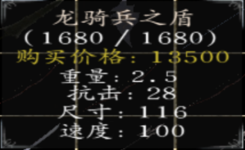

3、黑皇剑：单手武器，砍伤刺伤均不俗，各项能力超平均值，适合单手新手使用，黑色的外形看起来略为霸气（黑暗骑士八大配件之一）

4、暗炎盾：黑皇剑的配备品，朱红目前最强盾牌之一（应该可以排名第二），耐久度高，抗压抗打，唯一缺陷就是面积略小于龙盾黑色外形霸气，符合黑暗领主高冷的霸气外表（黑暗骑士八大配件之一）

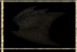

5、黑暗嗜杀者：与龙骑矛分庭抗礼的另一大陨铁骑枪（虽然在大部分玩家眼里略逊于龙骑矛），霸气的黑色外观也吸引了不少玩家（比之龙矛缺乏破格档并且不能挥砍，速度也略慢了些），（黑暗骑士八大配件之一）

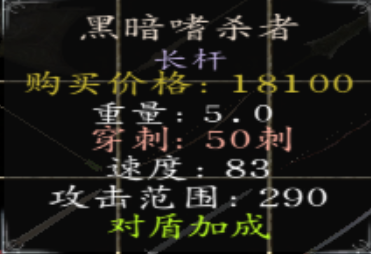

6、乌阙：作为整个朱红里面评价两极分化最为严重的武器之一，双手钝伤武器，其缺点在于过于笨重（那挥砍速度......并且重心不稳（即无法立即格挡）），并且由于在黑暗骑士手里伤害过于恐怖而被称为“孤儿武器”（黑暗骑士八大配件之一）

7、双月画戟（双月斩）：外表酷似方天画戟（无独有偶，只有公主不杀师击败戴安娜后才能获得的极品武器双月·魅斩也很像），伤害不俗，且属于骑枪长矛均可用的一种双配，而成为部分玩家及三啸本人的武器

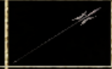

8、银蛇剑（银蛇之吻）：外表极为酷炫的一种双手武器（金蛇之吻无法制作，但比银蛇好了几百个档次），战斗力不俗，且公主开局为大师兄的武器，在反骑兵与骑兵；对付重甲/轻甲方面均能有建树

9、战锤：格斗锤的升级品，近战能力不低，也是陨铁武器里唯一单手钝伤（还达到40了），挥砍速度较快，范围较近，适宜贴脸

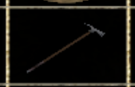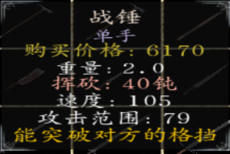

10. 吴钩：江湖弯刀升级品，各项属性还不错，但仅适用于度过前期（毕竟中后期这玩意算一般 金蛇木剑杀马特的对比下属于鸡肋 拿陨铁换又亏本）

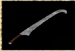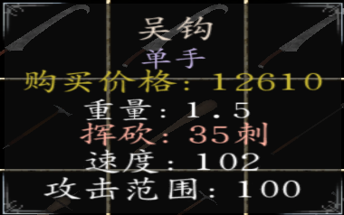

11. 审判者：精英手半剑的升级品，同吴钩，仅适用于前期

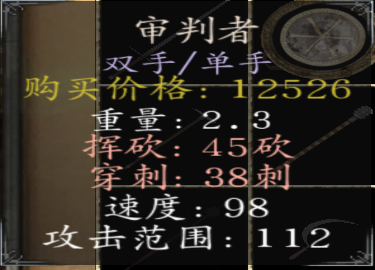

12. 圣锤：这个，不建议做，要做去做战锤（各项属性相同还比战锤重1.5 没谁了）

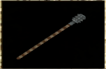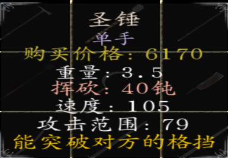

二：远程武器

1.  精灵长弓：步射最强刺弓，精度速度伤害均极为不俗，暗紫色的外表给人以致命的感觉，唯一的缺陷就是无法在马上用

2.  仁慈之翼：马上用的钝弓，伤害不俗，精度速度极高，外观华丽，适合仁慈圣主配套使用

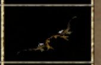

3.  汉王烈弓：被大砍一刀的骑弓（因为蒙古人也用），难度高了就是给人刮痧（不痒不痛），并不推荐自己制作

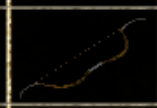

4.  最后的轻语：穿甲箭，10攻击力不是盖的，弹药量不少，适宜伤害流打法

5.  练习箭：懂得都懂不做解释（解释就是弹药量极为充足因此得到喜爱）

6.  精品标枪：16枚标枪，弹药量足够（但无法补充），伤害不俗（但不是很建议浪费陨铁，如果真想用就去扒大师兄的装备）

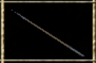

7.  诸葛连弩：打造的秘银连弩，战斗力极为不俗且为连弩，秘银外表极为炫酷（但不能在马上用）

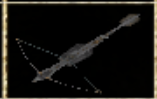

8.  梅花镖：玫瑰标枪的替代品，杀人补给，伤害不俗

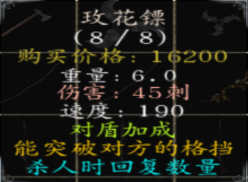

9、战姬弩：新加入的可以在马上用的弩，伤害不俗，有着与诸葛连弩相同的外表，唯一的缺陷是无法连发（一次两根）

10、破甲钢弩箭：与另一个版本不同，这个弩箭可以穿透盾牌，杀伤力极强，建议配合战姬弩or诸葛连弩配套使用

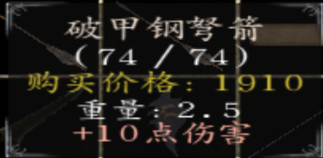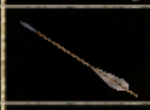

11、王者标枪：升级品是玫瑰标枪，投掷伤害比玫瑰低一点，且无法回复，在获得玫瑰之前可以用这个渡过

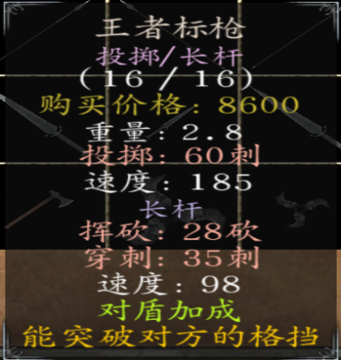

12、圣弩：唯一一个钝伤弩，用于步战仁慈圣主玩家去做，伤害不俗。

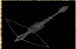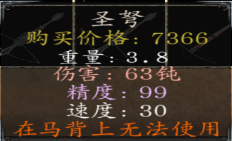

0三：盔甲与马匹

1.  银甲套装：三个陨铁换得，卡拉德女将必备，白天时30％几率免疫远程攻击

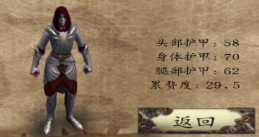

2.  金甲套装：五个陨铁换得，黄金女武神与卡拉德黄金女将必备，白天时50％免疫远程攻击

3.  黑暗套装：五个陨铁换得，黑暗兵种必备，晚上时60％免疫远程攻击

4.  银甲战马：一个陨铁＋一个骏马换得，卡拉德女将系列必备

5.  黑暗战马：一个陨铁＋一个猎马获得，黑暗系列必备

公主简单（不是难度，指的是我写的比较简单）攻略：

主线：（不杀师档没有三啸联盟军，三大会战全部胜利，除此之外差别不大）

1.  开局任务（公主在完成一定剧情前是只能带8人，但雇佣兵不占格子另说）：开局给两侍女全部点辅助技能（侍女再次归队时可以白嫖很多战斗属性）公主是比较弱的，因此按部就班地跟着走，接商人任务——回母后那里——找卡门——训练（彩蛋：如果你想保留新娘装就和一个侍女对调）

2.  新手教程（八人战队可以考虑剩下三个位置给不用级别要求的三个NPC：马尼德（做完商人任务）、亚米拉（做完镇长朋友女儿任务）、罗尔夫（做完剿几只盗匪的任务，一支盗匪给40第纳尔的那个）、艾雷恩（从帕拉汶铁匠那里领取买生铁的任务）：按部就班地跟着走，带着师徒四人做商人任务（马尼德入队，但难度高了建议不要开局去因为会被贴身伍长打自闭）刷劫匪、盗贼、绿林、山贼（山贼刷完后新手教程给的所有技能点给完，这时你可以考虑把格斗家和宗师刷了）、海贼（如果你打不过可以考虑刷级刷到20级然后拿箱子里的免费的两个神器：杀马特与金蛇；同时你可以集齐箱子里的幸运草获得女神眷顾），如果还是打不赢可以考虑效忠母后大人（即卡拉德女皇）成为元帅（看人品）后你就可以带着卡门和母后一起去打（此时他们会帮你打各路劫匪，师傅任务均可帮忙，但商人任务的盗贼不会，因为是中立兵种），打完蒙奇后，二师兄离队送你木剑，此时进入游戏最大的抉择：杀不杀师

3.  杀师档：杀师后回到国内找女皇对话再去帝都城堡领回侍女管侍二人，此时二人已经增加了许多能力，然后随便去一个城市打竞技大赛打赢后回去比武招亲，（这个并不难打练练技术就过了加油），打赢后送你一套银甲（对于公主早期而言算是神器了）然后帝都酒馆出现颜君加入，（由于女兵团任务需要，所有女NPC出现在帝都酒馆）然后再去找女皇，成为领主，恢复你的正常带兵数；这一个星期内赶快练兵，因为一个星期后朱坤回来（装备没变化换句话说他还有木剑），带着大量的格斗家（九十五个）来打你，打赢后接手德其欧斯堡；

4.  杀师档的三大会战：三大会战之前你需要屯好部队（本mod内，战团16NPC在你15级后一星期出现在酒馆中（此方式召入的马尼德没有商人技能）；你只能招募八个，因此请自行抉择（马尼德、亚提曼、亚米拉极其推荐）；建议全智魅工具人（杀师不好打）；同时三大会战之前建议刷五匪首（刷法请自行看上面称号介绍），屯大量的金甲女将和光明院士，这样基本不愁（事实上我大概算过，如果不飞这东西全部整完最少你游戏时间100天＋过去了，200＋都正常）（喊你屯这些因为后期不死族和黛安娜等系列任务让杂兵来打基本过不了）

5.  三大会战：打丝袜失去1/3的部队；打诺德失去1/2的部队；打维吉亚第一轮死绝第二轮NPC全部失散第三轮自己跳崖（不用担心你的部队，三啸剧情过后会还给你，所以记得留足够的位置免得你的兵回不来），然后正式进入三啸剧情（武器全丢装备全丢换上颜君的盔甲与木剑不过不用担心，后面也会还给你）

6.  三啸剧情：杀师独有，（亡灵档走的是公主杀师线）在你跳崖三天后，你被三啸救起，带到隐逸村（此时隐逸村出现在地图上），然后一番对话后你带着三啸部队去打托克（算了这里单刷吧此时的三啸那战斗速度太慢了）再然后单刷奥尔克七人军队（请管理好你的存档因为这是步战狂人）

7.  接下来技艺交换，（麻烦），提升点智力谋略啥的，然后筹钱五万（注意这个一定要在技艺交换后面不然废档）去修城（此时五印的用处就来了，我可以拿着五印去刷钱贼快）

8.  修好城，丝袜派人攻打，此时你只有一种选择：把丝袜攻城部队全宰了后慢慢回去（攻城部队隔一天刷一支）

9.  回国救兵，女皇不敢招惹哈劳斯，然后再回去帝都城堡看见侍女护侍二人（蒋新新曾琴琴），对话然后三大会战失去的士兵全部找回（此时侍女二人与颜君三人能力值大大提升），再对话找回自己的武器盔甲钱财然后回去杀穿丝袜围城主力后回国开始成亲任务。

10. 成亲任务：回到帝都带上主力选择成亲选项，克娜斯加入，婚礼后洞房里政变，杀死迪亚王子，占据大厅（开打后一段时间三啸带军加入），此时你发现你占据了这个城市，但这个城市的守军变成攻城部队准备攻下你的城池。一般而言会有1500左右。

11. 不死族任务：守住乌克斯豪尔，三啸说不死族出现，然后不死族满大街小巷的乱窜，之后回国找女皇可以领三精灵同时变成国家女王（或者元帅），然后再找卡门，所有精灵升到12级（记得加点），然后就直接抄家伙去打威廉古堡，打下来后不死族最后主力（龙玉＋魑魅魍魉＋联盟族长＋T-NA T-NC＋大量无头）抄家伙找你的麻烦，把他办了可以得到匕首（亡灵系的）然后全俘虏大概可以卖七万左右，然后找卡门得到光明法师支线任务与莫名法杖（如果你是女王，你与外界关系决定你的手下领主与外界关系，因此当女王可以让卡门和女皇帮你打龙玉与类似的任务）

12. 地狱任务：卡门死亡，死前遗念传达，地狱开启（扎营选项中，前提是你打赢龙玉的不死族最后主力），你和切娜双刷，单层为步兵，双层为射手，第十八层三啸加入，同时黑白无常孟婆出现（复制你们三个的装备），打赢后获得病毒抗体，最大生命值增加20％（三啸切娜增加50％）

13. 夜莺任务：抄家伙去乱葬岗，然后晚上带着NPC打夜莺中队（这里是为我所统帅的战场），日常肝帝杀穿系列，打赢后得到最强三刃：长刃·村雨；短刃·雪妖；战刃·止水（当下暂不可获得）之后母体给你你有两种选择：销毁/保留

    保留打法：（如果你的队伍里有亚米拉）把她装备扒光（免得你不好打），然后浸泡你的武器，出现剧情你用你浸泡的武器杀了她，亚米拉成为暴君（智力清零技能点变为负数，智力点平摊给力量与敏捷）

    销毁：城村关系＋好人领主关系全部增加10点（光明法师任务）

14. 再战丝袜：这东西很好打，去磨城市，磨下来最近的几座城市后黑暗势力接管，再接再厉全部抹掉，先去打暗黑特工队（除了你选的国家全部国家与你为敌），然后暗精灵出现与你决战（带着140左右的暗黑领主），打赢后脱逃，晚上追到村子里被卿尼安静（水精灵）迷惑，三啸及时赶到收了三精灵，但失去一臂，被暗精灵取代（臂膀）。三啸盔甲升级，暗黑势力全部领主投奔三啸（该缺领主还是缺）；

15. 蒙古入侵：蒙古入侵，直接抄家伙去打库吉特，然后留两座城市和一堆苟延残喘的领主

    后等待铁木真的入侵。（记住留两座城市免得坏档）铁木真一来就拉去村战或者让他攻城，总之骑射手绝不能有马，打完四次后铁木真投降，送阿喇海别和亲（不知道你是女的）（备注：会刺杀你，就像你刺杀迪亚王子那样），解决完后阿喇海别加入你的部队，同时你可以在你的城堡里训练蒙古部队了（方式和光明系一样）

16. 四国入侵：这是这个游戏公主档当下版本最终的结局，也是最难的一块，因为海外势力有特殊军队（开个测试档你就知道很难打），而四国被接手导致特种兵满地都是，你很难打（因此建议在蒙古时多招募领主，能挖就挖）

    公主不杀师线路与杀师线路区别：三大会战胜利，周围城堡三大会战胜利时候投靠玩家（同理，颜君不会入队），三啸会出现但与玩家没什么关系了（就是个诸侯国），乌克斯豪尔成亲任务不存在，龙玉和大师兄单挑可让大师兄拿到魂之挽歌，之后没啥大差别

    杀师装备怎么找回来？三啸系列任务做完后侍女归队，问管式/侍女对话有选项

    支线任务

<!-- -->

1.  红影女兵团：这个是支线任务，4个女性NPC尽量招募酒馆里的（因为现在红影女兵团完成之前卡拉德婢女升级慢死）。这东西加士气和减士气都很高，因此还是慎重选择你的4个NPC。

    如果你硬是想拖到后期也行，但这样的话招兵只能靠酒馆老板了（招兵招募女兵和卡拉德才女去换光明法师和黄金女将）

2.  光明法师：杀师是没有孝悌忠信和情深意重的，也就是说杀师你是走不完这条路的，最多利用熟练度刷到五级，第六级的五个称号你无法做到，不杀师在完成五个称号同时火器熟练度达到540后可出现天使

不杀师多的支线：在地狱任务期间，大师兄可挑战龙玉（一次机会），营地里有选项，挑战赢则获得龙玉的魂之·挽歌（只有大师兄和龙玉两个人使用时有顺势斩效果）

3、玫瑰枪获得方案：

杀师：打完乌克斯豪尔守城战后，地图上刷出特殊的不死军团（亡灵朱坤军团），打赢后开启“神秘的礼物”任务，去东周训练场对战大师兄三师兄要离（一打三，这里注意利用那棵树去卡师徒三人的远程武器视野，拉近身位后近身打败大师兄三师兄，再打败要离），打赢后获得标枪·玫瑰（极强的一种标枪，杀敌回复数量）

不杀师：朱坤回归后自动刷出“神秘的礼物”任务，到那里选选项就可获得

还有嘛，打公主，圣女个人的一点心得：

1、蒙古那个任务它告诉你是两个城镇（其实你一个都可以不用留），只要别灭国就行，灭国了就废挡了

2、公主的话其实没那么难，很多玩家都在抱怨领主不够的问题。其实从现实的角度来想，一个女权国家怎么招募男性领主。。。。。。所以三大会战屯个一两百光明院士＋黄金女武神你就可以一人统一国

3、很多人都说蒙古打不赢，那是没用过村战城战或者诱敌深入的反面教材

4、黛安娜能打的很，黑暗领主尽量还是找制约骑兵的兵或者村战（村战万金油）

5、打海外记得多屯骑兵（步兵太多容易当活靶子）

所以，村战不是亡灵的专利，公主也能用

亡灵攻略：（简单攻略，简单一词和公主一样）

提供亡灵感染的算法：感染一个士兵，成功几率＝母体等级/（母体等级+你想感染的士兵等级），也可以抓了在营地感染，几率一样（如果点传播病毒没有反应那就是你一个兵都无法感染成功，也就是母体等级太低，想感染士兵等级过高）

开局只有两个破NPC，啥都没有？不你还有把匕首和一根木棍（记住先肝母体等级再屯兵，如果可以吃点高级兵这样等级提升的快）

首先，你要想好你的定位，你是愿意做一个恶魔（烧杀抢掠无所不用），还是愿意做一个天使（击晕搞仁慈圣主），不要东换西换，因为这个东西不好换回来，然后作为圣女呢，就是给大家的几点建议：

1.  开局：亡灵其实由于自身与全世界敌对的缘故，是无法到处乱窜东买西买的，跑商流玩家请放弃你的一切想法，老老实实去肝；骑射流玩家和骑兵流玩家如果觉得开局打着不爽的可以在辣条来以后稍微肝一肝，读档多杀几次辣条去赚蠢驴，骑驴找马慢慢来。（开局最重要的一项备注：不要走地图上灰色和蓝色国家的路，宁可多绕绕，因为那两个地方的16NPC成为了领主，而其移动速度是比较吓人的-----被追过的玩家应该深有体会）

2.  开局10天左右：现在你的开局应该好了一些，至少装备好看了一些，下一步你就应该做出来如下几个事情：（1）、屯兵（拿去刷你的母体，高级兵留一两个镇守就行）；（2）、刷五印中的一个印记（这个刷哪个看个人了，我喜欢从海贼开始毕竟是步战玩家）；辣条如果感染了就多点点智力，没感染拿来养猪就刷出来就宰了。你是没有那个实力去碰领主和巡逻队的，所以还是猥琐发育为主，打架为辅助；

3.  开局30天左右：现在你应该已经获得了一个叫做“神秘的礼物”的任务，接下来看你的个人实际情况：如果你是比较肝的，已经有了陨铁武器，NANC装备也还过得去（如果刷了印记更好了因为这样你肯定是有几个铁的）那恭喜你了，你可以去东周训练场领取了，记得到时候调整下状态去打；如果不是，那就继续练，这个任务路过的时候顺道打一遍就行；在你打了东周训练场以后，就可以在东周训练了；也可以在东周考格斗家；当下版本屠城可以感染竞技场老板，你连红袍宗师都能在屠城后考下来

4.  开局50天左右：现在你应该有了1-3个印记在身上，那就可以去和龙玉单挑了；母体种子记得留一个给龙玉（战争机器），建议前两个给要离和大师兄孙宇，杀人效率也很高；沙尔辣条亚提曼三个智勇千万千万不要给，因为给了就无了；单挑赢龙玉后就去找卡拉德的商队解气

5.  开局70天左右：2-3-4个印记到手了，母体如果达到30级可以去挑战一下夜莺（估计也不行，因为那玩意确实难打，记得存档），然后就刷着剩下的印记过活。

6.  开局100天左右：刷的快一点的五印应该差不多了，这个时候可以去单挑卡门（其实哪怕你没碰到他都算你赢，让你现在去是因为打完卡门就等于接手不死族）；接手不死族以后就是开启大业的时候，建议从库吉特开刀，然后给乱葬岗建造墓园免得隔个三天两头就被烧了；如果你这个时候兵多点（母体40级最好）就可以打最近的库吉特城堡，多打几个（不过不要灭国不然蒙古出不来了），削弱国家实力；（夜莺一定要拿进来，那是不死战斗机器，战斗中死亡战斗后自动补充的那种，不过记住夜莺入队后守墓老头就没了）

7.  剩下的就是大陆统一大业了。

额外备注：开局10级可以和na nc对话选择职业 职业具体功能见下一页

开局18级再去对话可以触发老婆剧情 对话回去找老婆 开启地狱模式 打完后获得npc （友情提示：大家都知道 地狱难度不低 耗时长 且第十八层还有复制你装备的 所以这个时候 还是等自己手感好再去打 实在不行ctrl＋f4吧）

现在你的手下NA NC获得了一套技能：

1技能 是大师兄技能（战吼），跟大师兄一样，附带伤害为主伤害的7分之4周围120范围（其实挺近的自己去实践）〔现今版本增加了血牛，和亡灵双倍血效果的血牛不同，该血牛是50％加成，二者可叠加〕

2技能 跟冷血一样，攻防增加，溢出伤害传递  
3技能，100%杀敌感染，如果是38级以上的敌人，直接转换成濒危兵种（无头系列）  
4技能，可以直接招募 无头，点数成长跟母体等级相关，每2小时增加母体等级的点数， 招一个差不多980点左右

个人想法：如果你希望两个 NPC战斗性变强那就选一二技能（虽然一技能大师兄我从没见他用过）；如果你希望快速发育士兵那就三四技能（但这两个技能必须他们起来才有效，因为如果他们连打架都打不赢对手就别谈感染了）

本人大概看了一下，目前38级敌人还真没几个，因此直接感染无头难度还是很大，但也不是不可能（你看黑暗领主都是对吧？），而且100％感染确实很强了，毕竟主角自己都只有手术刀能做到这个地步，因此总的还是很强的  
冷血那个，纯纯粹粹的大幅度提升了两个暴君的战斗能力，因此战斗流还是很实用的。战吼嘛就是防止被围困。

接下来是打法备注：

1.  100天左右可以考虑把龙玉任务做完（单挑，感染光明系10个，找卡门单挑并除掉卡门），然后在母体到达45级左右可以去接手了（母体45级乱葬岗建了墓园以后出现恐怖军团守村子）

2.  烧村尽量挑偏远的地方免得被抓住（被领主抓住基本上是没有活路的）

3.  母体种子一定不要给辣条亚提曼沙尔这几个智勇技能，可以考虑先给要离、孙宇、朱坤三人，同时给龙玉留一个种子

4.  开局烧村后得到的战利品可以选择收起来，存到22个城镇的箱子里（乱葬岗能卖但是村长手里一般没多少钱），等你打下了一座城市，屠城以后，就可以卖了

5.  亡灵开局抢钱就依靠烧村子和抢劫商队，烧村子找诺德窝车则左边那座村子（地图最上方）与乱葬岗左边那座村子（就是喊你去打魔兽的那座村子，有一定危险）与地图右上角那座维吉亚村子（风险性比较小但还是有风险）

6.  亡灵开局就把阿修罗刷了，利用烧村里此时村里全是村民的这一特性轻松刷得。刷法其实很简单，进村子，直接收起武器让村民暴揍你一顿，等你血量低于30％就把1/4伤开启然后砍死村民20＋就可以了，不想损失分数的朋友们也可以退出战场之前调回满伤。至于有人问我装备太差怎么办？武士甲全套好啊

    9、开箱子可以考虑养猪起来的辣条（黑甲、硬皮甲、豪华银甲、不错的装备）

    10、亡灵无头兵种获得方法：后三列兵种被爆头出（分别对应濒危骑士、濒危游骑、濒危神射手、濒危卫士----获得几率与兵种等级和母体等级有关）

    11：亡灵系的bug：建造墓园以后不出军队（地图上亡灵游走军队太多或者等级太低，因此建议提高个人母体等级）

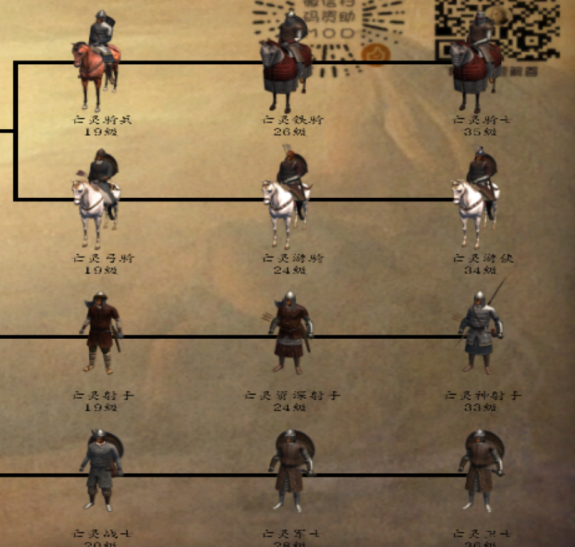

12、亡灵没有四国之乱（暂时没有）

13、卡门不出来就直接去城镇对话一样的效果（杀卡门任务时）

14、如果你感染了NPC却没有解决他的部队，那么他的部队会游走，并且他还是领主会定期获得经验（偷着乐去吧你），同时切记不要感染第二次，任何NPC感染第二次会变为一级的能力

圣女简单（同上）攻略：（备注：骑射者与虎牙弓神禁止入内）

1.  开局：开局该刷阿修罗就刷阿修罗（怎么刷？利用烧村里此时村里全是村民的这一特性轻松刷得。刷法其实很简单，进村子，直接收起武器让村民暴揍你一顿，等你血量低于30％就把1/4伤开启然后砍死村民20＋就可以了，不想损失分数的朋友们也可以退出战场之前调回满伤。至于有人问我装备太差怎么办？武士甲全套好啊）然后只要你的萨尔翼还活着没被抬下场子，就可以问他要个萨满卫士（开局拿不拿看你，我一般拿了早期战斗力就去找五印几位玩耍）

2.  正常走法：首先开局自带云戈长枪，虽然力量三十确实要升级很久但总归是有压箱底的，前期只管刷五印然后解除封印（备注：在解除封印之前可以和三啸与公主打两架收16npc，俘虏了直接对话信徒点洗脑就行，建议这个时候打是因为你效忠以后打不好恢复关系） 跟着剧情走 凯斯托剧情（算了，太恶心了，不想多提及）后开始帮助他复国打罗多克。

3.  打罗多克没什么太多好说的，就是正常一路雇佣兵升级萨满兵 问萨尔翼要兵，疯狂刷信徒点，同正常自立就行，如果之前16npc入队再有两三百个萨满其实战斗力就足以收复大半部分领土了。

4.  然后大家推翻凯斯托拥护你当国王，征服世界。

    支线任务：1、三刀（长刃·村雨、战刃·止水、短刃·雪妖）获得方法：首先，先把武士甲六件找齐，找齐以后给守墓老头换取27力量的六个精英装，然后再对话化身20年前夜莺武士，如果成功解决掉所有魔兽，获得三刀

    2、圣女神秘的礼物：15天左右出神秘的礼物任务，去东周训练场获取标枪·玫瑰（投掷神器）

    备注：兵种升级方法：

    萨满兵：

    雇佣射手--------雇佣弓手--------雇佣神射手--------萨满射手

    女护卫--------女剑士--------女中豪杰--------萨满灵女

    雇佣哨兵-----商队护卫-----雇佣剑士--------雇佣杀手-----精英杀手------萨满战士

    （此法仅限圣女使用，其他模式使用最后一个升级会999999999999第纳尔）

    萨满卫士-----萨满审判者（近战）/萨满猎杀者（远程）

    备注2：群里问问题打字不要打成剩女等故意的谐音字（打错请马上撤回），我不想天天赏人套餐。（不撤回我帮你撤回只不过有点代价）

    备注3：感化方法：俘虏NPC，且自己有3W信徒点，那么俘虏后对话，即可入队（第一个3W，第二个4W，第三个5W以此类推）

    来自群里肝帝倾城（虎牙弓神，群昵称暴君T-ND骑砍小萌新）的攻略：

    公主杀师档可利用的bug:

    1给3师兄加物品管理10主角一样会白嫖10点物品管理

    2:杀大师兄可能会出现21亿血量的时候不要慌，练武器熟练度的最佳时间

    3:获得母体源得时候打雅米拉可先拔光她的装备打了以后再给她穿

    4:打龙玉的时候可以叫卡门和女皇帮你（备注：要你是女皇而非元帅）

    5:4国齐宣自己的时候可以扎营花钱和平

    6:凡是无法获得的兵种部队都可以利用扎营收招降他们，火星人部队（海外军种）不能放城堡过夜就自动清除（要么卖了要么招募）

    7;朱红商店货性价比很高的有：

    a重钉头锤（NPC杀人利器）

    b精锐骑枪（早期骑兵党福利）

    c坚硬的精锐骑弓(1W多第纳尔贵，但伤害没的说)

    d攻城连弩（大批量生产装备的弩） 

    e精锐骑弓（伤害略逊于精锐品但总也是好的）

    f一大袋破甲钢弩箭（不用多说）

    g一大袋库吉特箭（不用多说）

    h极品轻弩（便宜实惠且可在马上使用）

    i弯曲的精锐骑枪（物美价廉）

    j轻弩 （更为便宜实惠）

    k库吉特弓（不多说）

    l弯曲的箭头 （和练习箭一个性质）

    M重骑弩（新加的能在马上用的骑弩，性价比不低）

    服装：鱼鳞甲/带翼巨盔

    公主可利用的地方：  
    1不接商人任务等于坏档  
    2管式侍女开箱子会被气死（啥都没有）  
    3新娘装会被卡门收走（可以和侍女对换衣服）  
    4马尼德任务不做商人的没有特技（bug）  
    5劫匪任务一打罗尔夫就很难解锁  
    6高难度给2师兄加统御给师兄弟们加战斗属性等于自虐（杀师的情况）  
    7三大会战（dddd懂得都懂）  
    8技艺交换在给钱以后无法完成，但大堆玩家总是不看任务介绍  
    9乌克斯豪尔的和亲和守卫任务失败的有多少  
    10和女皇对话拿元帅等于坏档的有多少  
    11龙玉的追击部队打完以后被魑魅魍魉围城半个月以上的有木有  
    12追击暗黑特工队有一队就算是开地图全亮都要找半天的有木有  
    13被铁木真大军灭团的有多少  
    14蒙古公主入队被宣战灭团的有木有

    15 四国之乱不知道要屯兵直接被打成二百五的有木有

    16 做艾雷特任务全图找生铁找不到几个的有木有

    圣女可利用的地方

    1、高级NPC快速招募：刷级，等到你等级比能入队的NPC（包括本mod精灵）高，打仗解救就可以让他们入队（16NPC可能会投奔过来入队后能力满级）

    开箱子问题：

    公主杀师傅与商人档专属彩蛋福利

    第一步：观察切娜等级与属性（强弓低于8骑术低于7）

    

    第二步：看切娜是否骑上骏马背着正常弓；

    

    第三步：给切娜的物品管理点到5  
     

    第四步：与切娜对话如图所示

    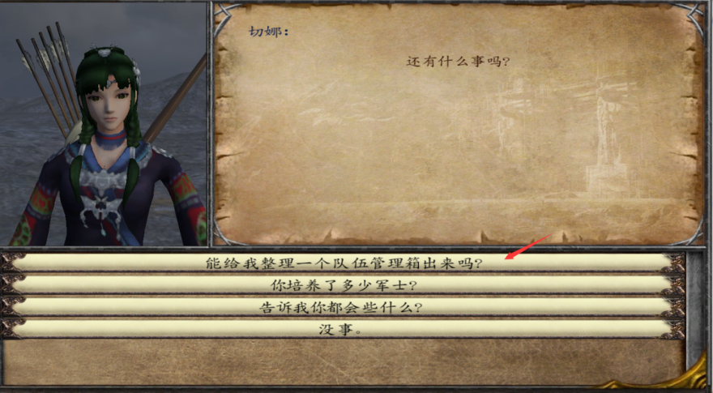

    第五步：查看箱子（可从对话界面或营地中）

    

    第六步：拿走你想要的极品武器（暮雨弓与佩奇）

    

    

    这个方法可适用于除萨尔翼和无法入队的NPC外的所有NPC

    作弊须知：

<!-- -->

1.  一旦选择了导入导出和魔球改变自身的能力值，你就只能玩简单模式了（不动自己的能力还是可以的）

2.  除了简单模式，其他模式ctrl看运气（飞天可以用三次），魔球和导入导出一次死

3.  你的魅力会关乎场上你的兵的生命值和最后一个敌人的生命值（魅力高一点生命值高一点），因此魅力太高会导致敌人最后一个敌人生命过高，请谨慎使用；智力过高会导致打仗获得经验过多升级太快，也请谨慎

4.  尽量不做弊才能体会到最好的游戏感

5.  附上三啸的一段话：

    为啥作弊玩家发的意见建议什么的，我基本上都不听。  
    人家几千行代码，写的骑射AI，结果他战场上直接艾弗斯将军秒全屏。几千行代码写的经济系统，他直接就康秋+x刷钱。作弊玩家没有尊重作者的劳动成果，所以作者也不喜欢为作弊玩家废什么精力

    6、友情提示：请不要把你的力量刷过63以免系统给你来一记误判到时候别去群里炮轰（来轰你看我轰不轰你就完了嗷）

    （超过63绝对有小屁孩杀人的）

    7、、（当然如果是为了图快乐那就另说）如果真想作弊，个人建议去低难度（比如正常简单，正常模式我测试下来对作弊很宽容），

    8、提供一下作弊目前测试结果：（以三神模式测试）

    （1）、飞天开局可用三次，但如果系统判定你周围有比你强大10倍起底的对手（比如你亡灵开局被卡拉德的领主/三啸的领主逮到）可以额外增加1-2次飞的机会（可以攒着）

    （2）、艾弗斯将军战场上用了看运气判定（好的话系统没判定到就没事判定到了就废档）（加血同理）

    （3）、四项基本属性第一个星期内升高超过30暴毙，之后（哪怕你打了破上限补丁）超过63暴毙（这个一定检测的出来不要抱有侥幸心理，魔球党导入导出党绕行）

    （4）、加钱加经验看运气（没判定不杀判定到就杀）

    烧村时当福利攻略可利用的BUG 地图上面的村子 马兹根  
    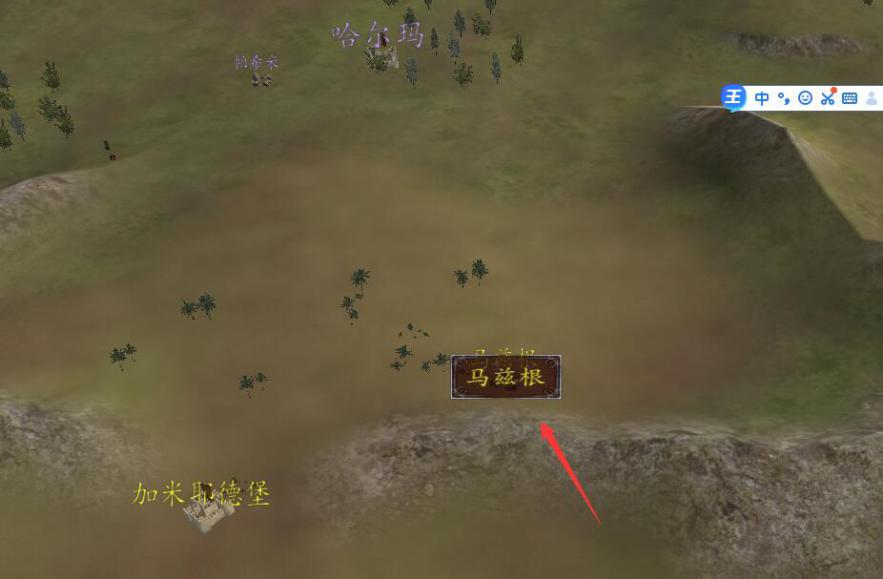  
     可以再楼梯上面无伤镇压农民 哪怕是顶级兵如图  
      
      
      
    操作细节就是上楼梯的时候最好退上去，为了避免右边出来远程的会揍人不要爬太高

    魔兽养成方案：

    1、找乱葬岗守墓老头接任务；

    2、在附近（包括乱葬岗在内的）四个村子均出现魔兽巢穴，当你的兵种序列≥6（即至少有六种兵）时可打，魔兽类型及难度由你打的第几个决定）

    3、魔兽培养：

    第一个魔兽蛋＋一套营养品可培养出魔兽

    第二个魔兽蛋＋二套营养品＋杀敌25人可培养出魔兽战士

    第三个魔兽蛋＋四套营养品＋杀敌120人可培养出魔兽战将

    第四个魔兽蛋＋六套营养品＋杀敌225人可培养出魔兽领主

    八套营养品＋杀敌800人可培养出魔龙教主

    魔龙教主拥有噬尸巨兽称号：杀敌2人增加一点生命值上限（无上限）和狼牙棒·暴风（顺势斩）

    魔兽的培养方向：如果是公主建议在打劫匪的时候就培养，这样子到了三大会战怎么也有魔兽战将（难度地狱及以下），难度高了那魔兽巨蛋不如卖钱

    如果是亡灵......算了营养品只能找老头要（屠城之前）

    因此亡灵更建议卖八万块（四颗蛋）

    当然，魔兽AI有点几十年脑血栓的感觉，因此想培养魔兽耐心一定要好

    开厂问题（收益均为第纳尔/每周，\*\*\*的厂子中的\*\*\*为开一个厂需要的钱）

    1、天鹅绒厂（原10000的厂子）现在是40W（4×10五次方），收益在二万-三万左右

    2、面包厂（原1500的厂子）现在是2700，收益在250-350左右

    3、啤酒厂（原2500的厂子）现在是8500，收益在500-650左右

    4、皮革厂（原5000的厂子）现在是25000，收益在2000-3000左右

    5、酒榨机（原4500的厂子）现在是15000，收益在1500-2000左右

    6、榨油机（原5000的厂子）现在是210000，收益在12000-20000左右

    7、铁器厂（原3500的厂子）现在是100000，收益在5000-10000左右

    8、织布作坊1（原5000的厂子）现在是35000，收益在1500-3000左右

    9、织布作坊2（原8000的厂子）现在是45000，收益在4000-5500左右

    额外备注、1铁器厂中的原料生铁可以取出来作为艾雷特收购生铁的任务（会导致铁器厂亏本，请谨慎使用）

    2、在开厂一段时间后需要你自己带着东西去别的地方卖（因为厂子大，生产的东西多了，当地对这种产品的需求饱和了）

    现在你想看哪个箱子里有杀马特和金蛇，先打开你的兵种树

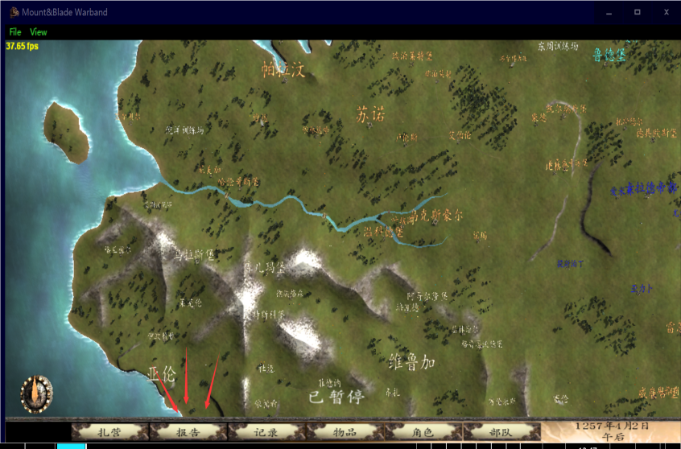

随便点一个兵种进入如下图所示的兵种树，再拉到最底下，点击这个人

然后疯狂点下一个兵种

等你出现幸运草的时候说明已经翻到了箱子一栏

接下来，你可以用这种方法去判断哪个箱子的幸运草没拿、每个城市的商人在卖什么、杀马特和金蛇在哪个箱子里

同时记住，你可以在这里看所有NPC的状态

https://tieba.baidu.com/p/6620345972?share=9105&fr=share&see_lz=0&sfc=copy&client_type=2&client_version=11.3.8.2&st=1586960799&unique=4D4F77278249A042634766D7E950F8BC&red_tag=1990192505

这个链接是百度贴吧的，可以复制粘贴这个链接去看所有箱子的位置

https://www.bilibili.com/video/BV1Ut411B7nE?from=search&seid=11841019649475539371

这个链接是b站三啸的（可以选集）

下一页附上每个箱子里的东西（不包含杀马特、金蛇，如果有打“/”号的表示这个城镇两个箱子）

日瓦丁：练习箭，练习弓，练习靴，练习骑枪

日瓦车则：硬弓/奇型甲，奇型短刀  
库劳：双手斧  
库丹：毛皮\*2  
窝车则：连衣裙\*2  
萨哥斯：耙子  
提哈：熏鱼/奇型盔，奇型长刀  
帕拉汶：手半剑，剑/练习弓，练习箭  
苏诺：平面骑兵盾  
乌克斯豪尔：工具\*2  
杰尔喀拉：夹板式皮护腿/奇型靴，奇型刀  
维鲁加：陶器  
亚伦：攻城连弩  
阿拉默德：萨兰德勇士盔  
巴瑞耶：萨兰德战斗斧  
都库巴：萨兰德链甲靴  
沙瑞兹：萨兰德皮甲  
哈尔玛：库吉特皮靴  
拉那：库吉特护盔  
图尔加：库吉特鳞甲背心  
艾车莫尔：库吉特弓  
卡拉德帝都：精锐匕首

兵种强度问题：

首先，先给一份个人实验下来的兵种能力表（简单模式测试的，可能实际会有所偏差，仅供参考）

朱红兵种强度：

第一光明院长与卡洛斯之心并列，

第三海外军队，

第四蒙古军团，

第五光明女武神和黑暗领主并列，

第七玛雅神射手与邪教军团，

第八野猪骑士和奥尔克并列，

第十驯兽师与无头兵种最高级四种与萨满军队，

同时附上各国兵种能力值体现方面：

诺德：由于身高加长外加自身能力优势，在山地对付骑兵是一大特色，同时在步战上有绝对统治力，但总体能力在朱红内而言还是鸡肋；尸化后能力有了质的飞跃

维吉亚：骑兵步兵弓箭手都有，雪地国家能力较为全面，在六国中战斗力不错，在火枪手接管后成为六国中最强的国家

丝袜：重骑横扫，但受制于罗多克的山地长矛手与连弩手，步兵和弩手则逊色许多，在黛安娜接管后野战和城战战斗力大幅度提升

罗多克：长矛手在对付骑兵上永远滴神，连弩手在射手中并不弱于谁，战斗力较为同全步战的诺德高，但机动性低，无法在战场上有效地制约对手射手与启动自身能力优势所在，在邪教接管后成为骑兵的梦魇

库吉特：骑射无双，骑兵冲击力极强，对射手和法师的威胁力极高，在战场上机动性极强，在蒙古接手后游击和野战都是极为强大的，但不论接手前后其村战城战都是废品

萨兰德：整体实力较为综合，但驯兽师能在任何时候出现就足以制约大部分对手，魔兽为萨兰德所驯服后能力极为强大，在驯兽师全面接手后野战村战都是一大威胁

卡拉德：作为新加入的女权国家，射手和骑兵均不逊色于六国，独有兵种光明系则在战斗力方面可排到第一，黄金系列可排到第五

三啸联盟军：作者自己给自己做的国家，每个军种都有自己的对应能力，合成的卡洛斯堪称骑射手第一（强于蒙古）与骑兵（无弓弩但可以用标枪的类型）前三（第一光明系与黑暗系），无任何缺点。

不死族：滚雪球专用种族，虽然正常兵（非无头）比其它国家弱小很多，且开局只有一个威廉古堡，但由于感染机制加上主角过头的T病毒属性，很容易打造自己的人海王国，同时无头兵种对付卡拉德和三啸或许不行，但打个六国还是绰绰有余的

萨满：萨满卫士也是滚雪球，但确实很强，虽然兵种树很少但精英啊

总有人不会卖俘虏里的领主和NPC，那么好今天他来了：

首先，你把他俘虏了，然后随便进入任何一个酒馆，不要找奴隶贩子，找酒馆老板——酒馆老板在朱红内也收俘虏

然后呢，现在你需要做一件事情：一次性全部卖掉（有选项），（一定要确保你的队伍里除了你要卖掉的NPC和领主之外还有别的小兵才行），这样就能卖掉了

一个领主大概在7000左右，而NPC看他具体能力

（反正我卖魑魅魍魉＋龙玉---不死族大军得了将近7W不知道现在如何）

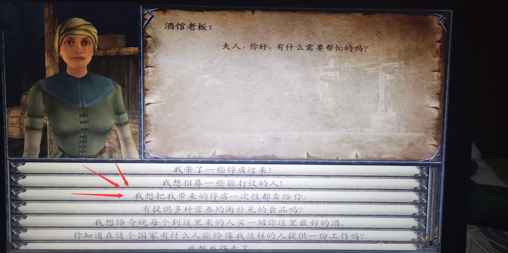

（一定要有别的士兵俘虏）

额外备注：1、关于个人加点问题

首先，不论你玩什么存档什么流派，都有加点方案

智力流：可以考虑20级营地火枪，此法点几何瞄准战斗力极高

力量流：可以考虑20级拿杀马特金蛇步战，此法对个人能力要求极高，但是也特别刺激

骑射流：记得点骑术骑射强弓（骑射火枪就点几何），此法容错率最高，甚至可以做到像倾城那样一刷几百

战斗流玩家加点：铁骨强击武器掌握格挡步战（或者铁骨强击武器掌握骑术骑射，格挡看情况点）

指挥流玩家加点：统御教练手术疗伤治疗几何瞄准

2、招匪兵问题：如果要招募匪兵，则有两种方法：

其一是到对应的营地招募三级兵（海盗、资深游击盗匪、江洋大盗、沙漠大盗、黑棋库吉特骑手，人类亡灵均可，当然亡灵招进队伍里活四个小时那就是另一个问题了），其二是在拿到对应的印以后在野外找（如果他打你可以让他滚，仅限人类）

3.  开厂问题：当下作者三啸加大了工厂赚钱的力度，因此可以利用面包厂等回本了（但一段时间后开始亏本）

4.  开箱子问题：亡灵开箱子随便选吧（装备到黑甲（不是黑暗套装）或银甲的辣条可以考虑，把箱子里面东西扒出来给NA NC穿也是好的），公主杀师就开切娜（骑射党，切娜有大陆最强暮雨弓）或者沙尔（步射党，当然连弩可以给NPC自己要那三匹马），同时记住，开箱子扒装备是扒NPC放在自己背包里的装备，不能拿走身上的装备（同时记住一点，一旦你开了箱子，该NPC失去了自动换装的功能）

如果有别的问题，或者有更好的意见，或者有游戏上的困惑等一系列需要都可以加Q群293143804（朱红之恋一群） 422577318（二群） 979426053（三群）

同时可以获得和作者交流的机会（作者是群主三啸）

如果有好的AI制作者有意向制作，也请与三啸联系（加快更新！！！！！）

神器获得：

1.  杀马特长枪：与金蛇之吻一样，在游戏角色20级后刷入幸运草箱子（见前面）任意两个箱子里（可升级 升级方法见6）

2.  、木剑·狙击：公主档专属福利（在师傅任务系列到达分支的时候朱坤给）

3.  、标枪·玫瑰：三条主线都有（公主档杀师在不死族出现后击败朱坤可获得任务去击败师徒四人中的剩余三人可获得；不杀师朱坤归队就可获得；亡灵圣女在20天左右可获得任务带着NA NC二人击败师徒四人获得）

4.  、猪王·乔治：公主杀师档帮助托克训练野猪系列的所有兵种5星获得

5.  、猪王·佩奇：与暮雨弓一样，开切娜的箱子获得

6.  、杀马特长枪·云戈：圣女开局送云戈，但要力量30，其它存档在获得杀马特长枪后帮助圣女破除封印获得。

7.  、三刃（长刃·村雨、战刃·止水、短刃·雪妖）：亡灵公主夜莺任务通过获得，圣女通过20年前的战役获得

8.  、魂之·挽歌：公主不杀师档大师兄单挑龙玉获得

9.  、双月·魅斩：与单刀·创清及鬼驹·绝影一样，公主杀师档不获得；不杀师档在完成黛安娜任务后三者皆可得

10. 、狼牙棒·暴雪：魔龙教主与封印守将专属

11. 、三啸特质混合弓：三啸专属

12. 、军棍·教鞭：与宗师格斗袍一样，成为红袍格斗家以后去打竞技场，胜利并且击败至少十二个人获得（同时也是要离的专属）

13. 、龙矛·冷锋、龙盾·冷面：公主档专属，在黄金女将星级训练全部完成后获得（属性均提高）

14. 、金蛇·萌萌、吴钩·小梅：专属品

    专属品均无法获得
