# 萌新入门攻略最新简洁版

::: info 来源说明
本页由上传的攻略文档 `萌新入门攻略最新简洁版-.docx` 自动转换为 Markdown。图片已提取到站点资源目录；如发现排版错位，建议在本页基础上人工校对。
:::

目录

注：本攻略对于部分问题没有写入，比如城镇开厂,箱子位置。需要找箱子的玩家可以到 p8 复制链接到浏览器看箱子位置

1.朱红绝大部分问题 p2-p7

2.武士甲及箱子问题 p7-p8

3.亡灵攻略 p9-p10

4.圣女攻略 p11

5.公主攻略 p12-p14

6.魔兽养成 p15

7.陨铁装备 p16-p21

1.陨铁，是本mod最有特色的物品，可以通过战斗获得陨铁碎片，碎片可在扎营选项内合成陨铁，陨铁可以造装备，包括强化武器  
  
2.技能点问题  
合并强击和强掷：只要升级强击便可使用标枪（商店里那些标枪的强掷自动看作强击，给NPC点后在大地图上隔一段时间才生效）

1.  铁骨增加免伤：点铁骨会有免伤加成，免伤的程度随着铁骨等级的增加而增加（奥尔克军种可以与其技能叠加）

2.  武器掌握增加暴击率：点武器掌握可以获得暴击率，暴击率获得的多少随武器掌握的点数的增加而增加，可与其它技能叠加

3.  增加新技能：格挡：格挡可以有几率抵消一部分伤害，抵消伤害的量与几率随着格挡等级的增加而增加，格挡等级高后可以把敌人对你的暴击伤害转化为普通伤害，致命伤害转化为暴击伤害，并且可以与格斗家共同加成

4.  改跑动为步战：除原跑动的收益以外，增加步战与步射时的暴击率与格挡率

5.  改工程学为机械学，上限改为15级（15级是云梯0小时制作，攻城车在一天内就可制作）

6.  增加统御新能力：人类NPC点统御可以招募贴身部队，贴身兵种（乡勇、伍长、百夫长、副将）与数量随着统御等级的增加而增加。贴身部队起码与否取决于NPC本身，NPC骑马就骑马，NPC步战就步战（本人点统御无贴身）；统御技能可以增加科技点与招兵点

7.  增加掠夺新能力：点了掠夺点的兵种（包括NPC与玩家）在杀人时会获得一定量的钱财，战后统一结算，获得量与技能点的多少成正比（掠夺等级上限改为15）

8.  增加新技能：意念/才艺（同一个技能）：

意念：若血量过低，则每三秒中恢复到最低血量值（最低血量值＝5＋该技能点数×2），没点时则为5

才艺：大地图上行进时有几率给部队增加士气

9.  增加新技能：激扬士气：战场上杀敌有几率增加士气，几率大小与技能点数成正比，每级增加5％；自己杀人多得（10％×技能等级）经验平摊给队伍。

10. 急救改变：残血状态下回血；不会回满，有水晶石之后会回满，普通的急救，12级，最高恢复到48%

11. 智力可加快读书速度，魅力可增加自己兵种血量和敌人最后一个兵种血量

12. 还有部分技能上限调整至12或15（手术调为6）

3.左下角冒红字  
启动器版本过低，群里有1.174战团文件  
如果版本够，冒红字可以截图发群，群内有大佬解答  
  
4.存档问题  
地图上走着走着跳出提示，然后游戏崩溃，这个存档废了。  
这是开高难度同时作弊了，导入导出和魔球修改自身属性都会导致系统判定作弊导致坏档，所以，想作弊就去简单模式，其他难度作弊…… 直接爬吧  
  
  
  
  
5.版本更新问题  
有的玩家下载了新版本后打开了旧版本的存档，结果发现乱码（此时你有两种选择，一是不要存档，直接关闭游戏然后下载回旧版本，依旧可以用；二是删除这个档因为代码无法兼容导致代码紊乱，然后利用新版本开始新游戏）一般而言，版本间如果只是字母的更动（就是数字不变但是字母在ABCDEF之类的改变）那就不用重新开档；但如果是数字上的改变，就得重新开档（因为数字改变意味着大版本更新）

6.NPC招募问题  
16NPC中只能招8个，亡灵感染可以招募全，圣女感化可以招募全

7.NPC和少部分领主的技能  
  
（1）马尼德：目前版本唯一一个有称号的，在经商城市达到一定数量后获得；商人；每到一个城市就会卖掉他携带的特产和你不要的战后战利品（根据交易等级计算）同时买下该城市的特产（另一座城市卖出）（如果在酒馆招募则无商人技能）。

2.  、亚米拉：手术：可以消耗一部分技能点将30％以下的一位NPC恢复到90％以上的血量，需要花一个小时（队伍中最前列的NPC）

3.  、罗尔夫：血牛：战场最大血量＋50％

4.  、克雷斯：疾风之舞（不写了自己看公主介绍）

5.  、杰姆斯：手术（消耗手术点给队伍最前列残血NPC回复血量）

6.  、亚提曼：智勇：（每一点智力提供2％伤害）

7.  、艾雷恩：修复武器（将前缀从差的变为好的，成功率与等级成正比）

8.  、马蒂尔德：盔甲修复（同修复武器）

9.  、贝斯图尔：驯马（同修复武器，但是驯马只能到重战马）

10. 、波尔查：疾行（大地图上按k可以加倍速度一段时间）

11. 、雷萨莉特：招募（花一部分技能点可以招募雇佣体系的三种兵：雇佣哨兵、雇佣骑兵、雇佣剑士）

12. 、班达克：招募（同雷萨莉特）

13. 、凯瑟琳：虐欲（受伤回复5点血，不论受伤多少值，当然如果死了就不会恢复了）

14. 、法提斯：嗜血（杀人回复10滴血，可受科技加成）

15. 、德赛维：狙击（爆头三倍伤害）

16. 、尼扎：无特技，以后或许会出

接下来是本mod的NPC，出现的位置各不相同，这个需要玩家自行体会

17. 、阿斯摩尔（木精灵）：战地援助（每两百秒回复所有人弹药）

18. 、卿尼安静（水精灵）：战地医疗（每三秒回复全军每人3点血量直至回满）

19. 、艾斯（火精灵）：刀剑强化（全军伤害提升10％）

20. 、塔莉娅（土精灵）：道路急整（行军速度增加30％）

21. 、艾丽娅（金精灵）：护甲强化（全军获得10％免伤，与铁骨相加，最高不超过80％免伤）

22. 、克娜斯（光精灵）：光愈（花费1200技能点与一个小时将全队回复到最大生命值，包括士兵）、招募（光明系军种）、血盾（按自身等级四倍为全队提供额外最大生命值）

23. 、黛安娜（暗精灵）：暗隐分身（晚上时每30秒召唤分身，分身继承本人的属性与当前装备，本体骑马就骑马，本体步战就步战，分身可以被俘虏后招募）

24. 、卡门：光愈（可以找其对话回复全军生命）、血盾

25. 、巴尔：招募（奥尔克军种）、铁骨

26. 、托尔：招募（哼哈军种）

27. 、切娜：招募（玛雅军种）、魅眼（每一点魅力提供一点真实伤害）、狙击（射击爆头三倍伤害）

28. 、三啸：智勇

29. 、颜君：嗜血、将帅（可以远程调用接管驻军的城堡或城镇的守军，一次招兵点只够调用1-2支，但城堡里的部队调哪只都行）

30. 、孙宇（大师兄）（万人敌）：血牛、战吼（对周围一片人造成伤害）、疾风之舞

31. 、朱坤（二师兄）（飞将军）：将帅（可以远程调用接管驻军的城堡或城镇的守军，一次只能调用1-2支）、招募（格斗家军种）、疾风之舞

32. 、沙尔：（三师兄）（赛诸葛）：智勇、疾风之舞

33. 、侍女、管侍：招募（卡拉德军种）、潜力（杀人涨属性比别人少20％的数量）

34. 、要离：疾风之舞、冷血（暴击和格挡几率翻倍，获得顺势斩效果（AOE伤害））

35. 、阿喇海别：驯马（这次可以到活泼的前缀）

36. 、五大匪首：招募（对应各自的匪兵）

37. 、辣条：智勇

38. 、魔龙教主：噬尸巨魔（杀两个人增加最大生命值1，无上限）

39. 、【邪教圣女】洛晨柔：冷血、格斗家（宗师）、疾风之舞、步战与砍杀（洛晨柔进入战场自动杀死所有人的马）（这个不是你自己玩的圣女，是你选其他模式的时候的圣女）

40. 、圣女（开局）：萨满圣女（不能杀人只能击晕、进入战场自动杀马，个人伤害-10％）

41. 、

【萨满大祭司】萨尔翼：求助热线、 招募萨满  
【萨满大将军】玉衡：每场战斗额外3个萨满炮灰 （类似贴身系列）  
【 狮 王 】SixSixCCFF  （力量） 大师兄所有技能  
【 蝠 王 】红墨  （敏捷） 冷血类技能   冷血 疾风  
【 鹰 王 】东方敏杰  （智力） 智勇    鹰眼：提供额外的读书时，速度等于 读书人智力+鹰王智力  
【 龙 王 】Xx龙 （魅力）口若悬河：每点魅力额外增加信徒值每天，做村庄任务时，额外增加说服力点关系。

（42） 、莎莉安：商人 （同马尼德） 只有亡灵档能获得，在NA,NC获得技能后，回到萨哥斯的家，杀两个诺皇和一个NPC，难度不高，之后挑战十八层地狱（也就是亡灵竞技场，遇到所有等级的亡灵，18层的难度较高）还能进入酒馆买营养品，卖俘虏儿~  
其他待补充

称号问题：

阿修罗：一场战斗30％血以下杀敌20人（等级不能低于自己五级，比如你是10级，你杀的20人最低5级）；效果：每损失2％血增加1％伤害（击晕可以刷阿修罗）

1.  嗜血魔王：杀敌人数超过击晕人数500人（杀敌数－击晕数＞500人可获得）（与仁慈圣主冲突）效果：杀人回复血量（最开始为1点，然后杀到1600回复2点，杀到3600回复3点，以此类推，算法为（20N）²，N为回复的血量）

2.  仁慈圣主：击晕人数超过杀敌人数500人（击晕数-杀敌数＞500人可获得）（与嗜血魔王冲突）效果：统御＋2（俘虏管理算在统御内）、劝降俘虏时几率翻倍（说服力＋2仅限于劝降俘虏），和正直的、温和的领主每三天关系＋1，公主支线任务光明法师所需

3.  竞技之王：竞技大赛胜利三次，效果：每次下注时会有人跟着你下注（赢了钱得更多）

4.  训练冠军：完成竞技场基本训练，效果：近战武器熟练度＋50，敏捷＋4，每周声望＋5，声望＋20/

5.  疾风之舞：简单赠送品/公主档拜师要离在获得训练冠军后获得，效果：以敏捷和格斗家等级增加暴击率

6.  格斗家：在训练场考格斗家，共六个等级，最后一个等级要在城镇打红袍格斗家专场真剑格斗，击倒12人并获得冠军，效果：增加跑动，每周增加声望（如果有疾风之舞也顺带加成）

7.  人贩鼻祖：卖1000个俘虏，效果：卖俘虏获得额外20％金额

8.  富甲天下：拥有80万第纳尔，效果：增加3魅力，每周增加声望

9.  虎豹之将：单挑胜利50次，效果：战场上杀敌增加士气和让敌军士气低下的几率翻倍

10. 驯兽师：孵化魔兽巨蛋，效果：战场上多个魔兽（不会出现在你队列里）

11. 地狱使者（与平民守护者冲突）：烧村7座，效果：烧村金额＋20％

12. 平民守护者（与地狱使者冲突）：接村长任务练农民防盗匪或直接打村子里的盗匪10次，效果：招兵免费且数量翻倍，每周声望＋5

13. 幸运女神的眷顾：集齐22个城镇箱子里的幸运草（20级以后随机两个箱子有杀马特长枪和金蛇之吻），效果：45血及以上要被秒杀时保留1滴血活下来

14. 海洋之印：杀5队海贼（杀完后刷出海寇），杀五队海寇（杀完后刷出海盗），杀五队海盗（杀完后刷出海盗头子），杀五队海盗头子（路飞出现）击败路飞后两小时路飞入队（俘虏放走均可但俘虏了马上卖掉不然容易出bug）

15. 草原之印：杀五队马贼（杀完后刷出响马），杀五队响马（杀完后刷出黑旗库吉特骑手），杀五队黑旗库吉特骑手（杀完后刷出黑旗库吉特精英骑手），杀五队黑旗库吉特精英骑手（罗德里格出现）击败罗德里格后两小时罗德里格入队（俘虏放走均可但俘虏了马上卖掉不然容易出bug）

16. 森林之印：杀五队绿林强盗（杀完后刷出游击盗匪），杀五队游击盗匪（杀完后刷出资深游击盗匪），杀五队资深游击盗匪（杀完后刷出游击盗匪头目），杀五队游击盗匪头目（罗宾汉出现），击败罗宾汉后两小时罗宾汉入队（俘虏放走均可但俘虏了马上卖掉不然容易出bug）

17. 高山之印：杀五队山贼（杀完后刷出土匪），杀五队土匪（杀完后刷出江洋大盗），杀五队江洋大盗（杀完后刷出江洋大盗头目），杀五队江洋大盗头目（埃瑟罗德出现），击败埃瑟罗德后两小时埃瑟罗德入队（俘虏放走均可但俘虏了马上卖掉不然容易出bug）

18. 沙漠之印：杀五队沙漠盗贼（杀完后刷出沙漠强盗），杀五队沙漠强盗（杀完后刷出沙漠大盗），杀五队沙漠大盗（杀完后刷出沙漠大盗头目），杀五队沙漠大盗头目（阿里巴巴出现），击败阿里巴巴后两小时阿里巴巴入队（俘虏放走均可但俘虏了马上卖掉不然容易出bug）

每个印记增加玩家本人掠夺1点，同时可以在野外招募对应野怪，也可在被打时赶走他们

19. 无奈匪途：掠夺10万第纳尔（注意是掠夺技能掠夺的钱，每场战斗左下角会显示掠夺了多少而不是你的财富），效果：掠夺获得金钱＋20％，荣誉—5

20. 匪名遐迩：掠夺30万第纳尔（注意是掠夺技能掠夺的钱，每场战斗左下角会显示掠夺了多少而不是你的财富），效果：掠夺获得金钱＋40％，荣誉—10

21. 霸者强权：掠夺100万第纳尔并获得五印（注意是掠夺技能掠夺的钱，每场战斗左下角会显示掠夺了而多少不是你的财富），效果：收回五印称号（包括已经加的掠夺）掠夺获得金钱＋100％，荣誉—20，队伍中所有NPC掠夺技能点＋6（注意是所有）

22. 诚心至腹：领主关系总和800，效果：与领主关系增加时每次额外＋1，每周声望＋5，公主支线任务光明法师所需

23. 敬若神明：城村关系总和800，效果：与城村关系增加时每次额外＋1，每周声望＋5，公主支线任务光明法师所需

24. 孝悌忠信：公主档开局获得，杀师则取消，效果：每三天和正直的领主关系＋1，公主支线任务光明法师所需

25. 义深情重：公主档不杀师获得，效果：公主支线任务光明法师所需

26. 冷血：公主档杀师获得，效果：暴击和格挡几率翻倍，获得顺势斩效果（近战伤害溢出就传递给下一个敌人，换言之可以一箭双雕），每三天和正直领主关系—1

27. 积劳成疾：公主杀师在三啸联盟军任务系列完成后获得，每场战斗减少50％的血量，无法通过在城镇休息等方法消除，会一直伴随着杀师公主

28. 影武者：公主杀师档颜君送你的一套装备的技能，在战场上你死时（若颜君没死）让颜君替代你去死，你按H在颜君的位置复活

29. 萨满圣女：圣女出生获得，进入战场自动杀马（所有马包括支援者的马一道杀掉），同时减少自身对敌10％伤害，只能打晕对手而不能杀死对手（后半截是一个称号，叫仁爱之心，不论用什么武器，因此这个和仁慈圣主绝对是配套使用）

30. 仁爱之心：战场上减少对敌10％伤害，只能打晕而不能杀死对手

称号之间的矛盾（即无法同时获得）：嗜血魔王与仁慈圣主；平民守护者与地狱使者；萨满圣女和嗜血魔王

称号之间的可抵消性：利用仁慈圣主的3天正直领主关系＋1可抵消掉冷血的3天正直领主关系-1

永久性称号：积劳成疾（无法消除，建议和嗜血魔王与阿修罗一起使用）

五印：即海洋之印、森林之印、高山之印、草原之印、沙漠之印（在获得霸者强权后收回），必须同时集齐且掠夺100W才可拥有霸者强权

无实际意义的称号：义深情重（只对光明法师支线任务有用）

杀人涨属性：NPC与主角杀一定数量的敌人就能4种属性各涨1点，杀人数与智力成反比（具体算法：玩家的量：第一次是（力敏魅三者的和-智力＋30）×1.5＋100（商人档第一次为150，即最低150）；此后每一级都是（上一级杀人数＋力敏魅-智力）x1.5＋100；NPC的量：第一次是（力敏魅三者的和➖智力＋30）×1.2；此后每一级都是（上一级杀人数＋力敏魅-智力）x1.2＋30（其实具体多少不用自己去算，你只需要知道加智力可以减免杀敌涨属性即可）

最大血量上限：NPC每级获得20％额外血量，而主角则每做一个任务获得1％额外血量上限（可和科技叠加，主角本人拿不到血牛）

兵种特色：掠夺能力：杀人得钱，得到的数量与自己的掠夺等级成正比

铁臂：初始10％免伤，每级1％免伤能力，可与铁骨叠加

血牛：兵种双倍血量

疾风之舞、血盾、魅眼：不变

朱红火枪：20级时扎营选项有，答案如下↓  

萌新问题你都了解了，嘿嘿嘿，真有耐心~  
  
  
  
  
  
武士甲任务：

在地图上找到战团三宝箱里面的武士甲,在杰尔喀拉的马匹贩子旁边稻草堆里、提哈的船上、日瓦车则拐角的稻草堆里

其他箱子没有翻的必要

金蛇剑和杀马特长枪获得：

人物30级时，城镇箱子会随机刷出金蛇和杀马特

具体怎么看呢，

首先打开兵种树 

随便找到一个兵种

拉到最下边的兵种，然后疯狂下一个兵种

等你翻到幸运草时说明翻到箱子了~

然后你就可以通过这种方法判断哪里有金蛇和杀马特了~

附上一段箱子位置的链接:

https://tieba.baidu.com/p/6620345972?share=9105&fr=share&see_lz=0&sfc=copy&client_type=2&client_version=11.3.8.2&st=1586960799&unique=4D4F77278249A042634766D7E950F8BC&red_tag=1990192505

亡灵攻略

提供亡灵感染的算法：感染一个士兵，成功几率＝母体等级/（母体等级+你想感染的士兵等级），也可以抓了在营地感染，几率一样（如果点传播病毒没有反应那就是你一个兵都无法感染成功，也就是母体等级太低，想感染士兵等级过高）

开局只有两个破NPC，啥都没有？不你还有把匕首和一根木棍（记住先肝母体等级再屯兵，如果可以吃点高级兵这样等级提升的快）

首先，你要想好你的定位，你是愿意做一个恶魔（烧杀抢掠无所不用），还是愿意做一个天使（击晕搞仁慈圣主），不要东换西换，因为这个东西不好换回来，然后作为圣女呢，就是给大家的几点建议：

1.  开局：亡灵其实由于自身与全世界敌对的缘故，是无法到处乱窜东买西买的，跑商流玩家请放弃你的一切想法，老老实实去肝；骑射流玩家和骑兵流玩家如果觉得开局打着不爽的可以在辣条来以后稍微肝一肝，读档多杀几次辣条去赚蠢驴，骑驴找马慢慢来。（开局最重要的一项备注：不要走地图上灰色和蓝色国家的路，宁可多绕绕，因为那两个地方的16NPC成为了领主，而其移动速度是比较吓人的-----被追过的玩家应该深有体会）

2.  开局10天左右：现在你的开局应该好了一些，至少装备好看了一些，下一步你就应该做出来如下几个事情：（1）、屯兵（拿去刷你的母体，高级兵留一两个镇守就行）；（2）、刷五印中的一个印记（这个刷哪个看个人了，我喜欢从海贼开始毕竟是步战玩家）；辣条如果感染了就多点点智力，没感染拿来养猪就刷出来就宰了。你是没有那个实力去碰领主和巡逻队的，所以还是猥琐发育为主，打架为辅助；

3.  开局30天左右：现在你应该已经获得了一个叫做“神秘的礼物”的任务，接下来看你的个人实际情况：如果你是比较肝的，已经有了陨铁武器，NANC装备也还过得去（如果刷了印记更好了因为这样你肯定是有几个铁的）那恭喜你了，你可以去东周训练场领取了，记得到时候调整下状态去打；如果不是，那就继续练，这个任务路过的时候顺道打一遍就行；在你打了东周训练场以后，就可以在东周训练了；也可以在东周考格斗家；当下版本屠城可以感染竞技场老板，你连红袍宗师都能在屠城后考下来

4.  开局50天左右：现在你应该有了1-3个印记在身上，那就可以去和龙玉单挑了；母体种子记得留一个给龙玉（战争机器），建议前两个给要离和大师兄孙宇，杀人效率也很高；沙尔辣条亚提曼三个智勇千万千万不要给，因为给了就无了；单挑赢龙玉后就去找卡拉德的商队解气，不给他们暴君的原因是暴君种子会强制把智力降为0。

5.  开局70天左右：2-3-4个印记到手了，母体如果达到30级可以去挑战一下夜莺（估计也不行，因为那玩意确实难打，记得存档），然后就刷着剩下的印记过活。

6.  开局100天左右：刷的快一点的五印应该差不多了，这个时候可以去单挑卡门（其实哪怕你没碰到他都算你赢，让你现在去是因为打完卡门就等于接手不死族）；接手不死族以后就是开启大业的时候，建议从库吉特开刀，然后给乱葬岗建造墓园免得隔个三天两头就被烧了；如果你这个时候兵多点（母体40级最好）就可以打最近的库吉特城堡，多打几个（不过不要灭国不然蒙古出不来了），削弱国家实力；（夜莺一定要拿进来，那是不死战斗机器，战斗中死亡战斗后自动补充的那种，不过记住夜莺入队后守墓老头就没了）

7.  剩下的就是大陆统一大业了。

提示：亡灵无法感染除原版NPC外的任何NPC，也就是无法感染公主等NPC，战团16NPC感染直接入队，领主NPC感染他会加入你阵营（亡灵领主贼弱，打架不能靠他们）

现在你的手下NA NC获得了一套技能：

1技能(狂战士) 血牛 战吼，战吼伤害是大师兄技能的7分之4伤害，周围120

范围（距离很近，大致距离可以参考武士长刀攻击距离）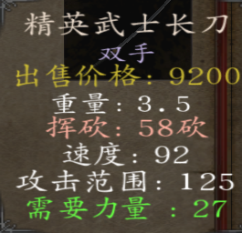

2技能（刺客） 跟冷血一样，攻防增加，溢出伤害传递，增强战斗能力

3技能（首席大臣）100%杀敌感染，如果是26级以上的敌人，直接转换成濒危兵种（无头系列）

4技能（刽子手），可以直接招募 无头，点数成长跟母体等级相关，每2小时增加母体等级的点数， 招一个差不多980点左右

打法备注：

100天左右可以考虑把龙玉任务做完（单挑，感染光明系10个，找卡门单挑并除掉卡门），然后在母体到达45级左右可以去接手了（母体45级乱葬岗建了墓园以后出现恐怖军团守村子）

1.  烧村尽量挑偏远的地方免得被抓住（被领主抓住基本上是没有活路的）

2.  母体种子一定不要给辣条亚提曼沙尔这几个智勇技能，可以考虑先给要离、孙宇、朱坤三人，同时给龙玉留一个种子

3.  开局烧村后得到的战利品可以选择收起来，存到22个城镇的箱子里（乱葬岗能卖但是村长手里一般没多少钱），等你打下了一座城市，屠城以后，就可以卖了

4.  亡灵开局抢钱就依靠烧村子和抢劫商队，烧村子找诺德窝车则左边那座村子（地图最上方）与乱葬岗左边那座村子（就是喊你去打魔兽的那座村子，有一定危险）与地图右上角那座维吉亚村子（风险性比较小但还是有风险）

5.  亡灵开局就把阿修罗刷了，利用烧村里此时村里全是村民的这一特性轻松刷得。刷法其实很简单，进村子，直接收起武器让村民暴揍你一顿，等你血量低于30％就把1/4伤开启然后砍死村民20＋就可以了，不想损失分数的朋友们也可以退出战场之前调回满伤。至于有人问我装备太差怎么办？武士甲全套好啊

9、开箱子可以考虑养猪起来的辣条（黑甲、硬皮甲、豪华银甲、不错的装备）

10、亡灵无头兵种获得方法：后三列兵种被爆头出（分别对应濒危骑士、濒危游骑、濒危神射手、濒危卫士----获得几率与兵种等级和母体等级有关）

11：亡灵系的bug：建造墓园以后不出军队（地图上亡灵游走军队太多或者等级太低，因此建议提高个人母体等级）

12、亡灵没有四国之乱（暂时没有）

13、卡门不出来就直接去城镇对话一样的效果，也可以通过攻城选项与指挥官对话,就能

单挑卡门，记得备份（杀卡门任务时）

14、如果你感染了NPC却没有解决他的部队，那么他的部队会游走，并且他还是领主会定期获得经验（偷着乐去吧你），同时切记不要感染第二次，任何NPC感染第二次会变为一级的能力

圣女攻略

1.  开局：开局该刷阿修罗就刷阿修罗（怎么刷？利用烧村里此时村里全是村民的这一特性轻松刷得。刷法其实很简单，进村子，直接收起武器让村民暴揍你一顿，等你血量低于30％就把1/4伤开启然后砍死村民20＋就可以了，不想损失分数的朋友们也可以退出战场之前调回满伤。至于有人问我装备太差怎么办？武士甲全套好啊）然后只要你的萨尔翼还活着没被抬下场子，就可以问他要个萨满卫士（开局拿不拿看你，我一般拿了早期战斗力就去找五印几位玩耍）

2.  开局10天左右：现在你的开局应该好了一些，至少装备好看了一些，下一步你就应该做出来如下几个事情：1、开始刷印记（山贼沙漠任选，这两个没了马跟儿子一样，母茨子啸啸口常开）；2、存招兵点（也就是你的信徒点）----招募俘虏、战利品给萨尔翼

3.  开局20天左右：刷出来神秘的礼物，带上你最好的武器去东周训练场一穿四（多练练技术最好上来先把要离穿掉）

4.  开局40天左右：二印应该刷完了（我相信大家的肝度），信徒点怎么三万都有了，如果有仁慈圣主就反复刷江洋大盗头目疯狂刷信徒点（招募俘虏在有仁慈圣主后不损士气也不会逃跑）

5.  开局60天左右：三印了，信徒点该有7W了，这个时候应该有30萨满兵起底了，可以开始抓第一个封印点（自选，我一般先把萨满大祭司的能力放出来---丝袜的）然后就一路冲锋陷阵直到五印刷完＋六封印点解除（备注：解除第六个封印点直接出黑暗，150天后出蒙古，所以万事速度，一定做好最好准备）

6.  开局150天左右：可以开始自立了，先捡漏拿三啸联盟军/卡拉德帝国的NPC开刀（也有别的方案让他们入队：自立然后刷声望荣誉统治点然后去游说他们加入或者等自己投靠或者在野外把他们救出来询问是否加入（等级比他们高的话理论上都可以，这种法子可以招募进来光精灵等原本无法招募的NPC），这样的话你就可以白嫖大量系统原本送给AI阵营NPC的能力值，缺点是太吃后期，如果早期缺NPC刷输出的还是先感化一两个）

7.  开局200天左右：蒙古入侵，圣女的最终抉择了。横扫四国变数很多，就不列举攻略了。

备注：兵种升级方法：

萨满兵：

雇佣射手--------雇佣弓手--------雇佣神射手--------萨满射手

女护卫--------女剑士--------女中豪杰--------萨满灵女

雇佣哨兵-----商队护卫-----雇佣剑士--------雇佣杀手-----精英杀手------萨满战士

（此法仅限圣女使用，其他模式使用最后一个升级会999999999999第纳尔）

萨满卫士-----萨满审判者（近战）/萨满猎杀者（远程）

备注2：群里问问题打字不要打成剩女等故意的谐音字（打错请马上撤回），我不想天天赏人套餐。（不撤回我帮你撤回只不过有点代价）

备注3：感化方法：俘虏NPC，且自己有3W信徒点，那么俘虏后对话，即可入队（第一个3W，第二个4W，第三个5W以此类推）

公主攻略

主线：（不杀师档没有三啸联盟军，三大会战全部胜利，除此之外差别不大）

1.  开局任务（公主在完成一定剧情前是只能带8人，但雇佣兵不占格子另说）：开局给两侍女全部点辅助技能（侍女再次归队时可以白嫖很多战斗属性）公主是比较弱的，因此按部就班地跟着走，接商人任务——回母后那里——找卡门——训练（彩蛋：如果你想保留新娘装就和一个侍女对调）

2.  新手教程（八人战队可以考虑剩下三个位置给不用级别要求的三个NPC：马尼德（做完商人任务）、亚米拉（做完镇长朋友女儿任务）、罗尔夫（做完剿几只盗匪的任务，一支盗匪给40第纳尔的那个）、艾雷恩（从帕拉汶铁匠那里领取买生铁的任务）：按部就班地跟着走，带着师徒四人做商人任务（马尼德入队，但难度高了建议不要开局去因为会被贴身伍长打自闭）刷劫匪、盗贼、绿林、山贼（山贼刷完后新手教程给的所有技能点给完，这时你可以考虑把格斗家和宗师刷了）、海贼（如果你打不过可以考虑刷级刷到20级然后拿箱子里的免费的两个神器：杀马特与金蛇；同时你可以集齐箱子里的幸运草获得女神眷顾），如果还是打不赢可以考虑效忠母后大人（即卡拉德女皇）成为元帅（看人品）后你就可以带着卡门和母后一起去打（此时他们会帮你打各路劫匪，师傅任务均可帮忙，但商人任务的盗贼不会，因为是中立兵种），打完蒙奇后，二师兄离队送你木剑，此时进入游戏最大的抉择：杀不杀师

3.  杀师档：杀师后回到国内找女皇对话再去帝都城堡领回侍女管侍二人，此时二人已经增加了许多能力，然后随便去一个城市打竞技大赛打赢后回去比武招亲，（这个并不难打练练技术就过了加油），打赢后送你一套银甲（对于公主早期而言算是神器了）然后帝都酒馆出现颜君加入，（由于女兵团任务需要，所有女NPC出现在帝都酒馆）然后再去找女皇，成为领主，恢复你的正常带兵数；这一个星期内赶快练兵，因为一个星期后朱坤回来（装备没变化换句话说他还有木剑），带着大量的格斗家（九十五个）来打你，打赢后接手德其欧斯堡；

4.  杀师档的三大会战：三大会战之前你需要屯好部队（本mod内，战团16NPC在你15级后一星期出现在酒馆中（此方式召入的马尼德没有商人技能）；你只能招募八个，因此请自行抉择（马尼德、亚提曼、亚米拉极其推荐）；建议全智魅工具人（杀师不好打）；同时三大会战之前建议刷五匪首（刷法请自行看上面称号介绍），屯大量的金甲女将和光明院士，这样基本不愁（事实上我大概算过，如果不飞这东西全部整完最少你游戏时间100天＋过去了，200＋都正常）（喊你屯这些因为后期不死族和黛安娜等系列任务让杂兵来打基本过不了）

5.  三大会战：打丝袜失去1/3的部队；打诺德失去1/2的部队；打维吉亚第一轮死绝第二轮NPC全部失散第三轮自己跳崖（不用担心你的部队，三啸剧情过后会还给你，所以记得留足够的位置免得你的兵回不来），然后正式进入三啸剧情（武器全丢装备全丢换上颜君的盔甲与木剑不过不用担心，后面也会还给你）

6.  三啸剧情：杀师独有，（亡灵档走的是公主杀师线）在你跳崖三天后，你被三啸救起，带到隐逸村（此时隐逸村出现在地图上），然后一番对话后你带着三啸部队去打托克（算了这里单刷吧此时的三啸那战斗速度太慢了）再然后单刷奥尔克七人军队（请管理好你的存档因为这是步战狂人）

7.  接下来技艺交换，（麻烦），提升点智力谋略啥的，然后筹钱五万（注意这个一定要在技艺交换后面不然废档）去修城（此时五印的用处就来了，我可以拿着五印去刷钱贼快）

8.  修好城，丝袜派人攻打，此时你只有一种选择：把丝袜攻城部队全宰了后慢慢回去（攻城部队隔一天刷一支）

9.  回国救兵，女皇不敢招惹哈劳斯，然后再回去帝都城堡看见侍女护侍二人（蒋新新曾琴琴），对话然后三大会战失去的士兵全部找回（此时侍女二人与颜君三人能力值大大提升），再对话找回自己的武器盔甲钱财然后回去杀穿丝袜围城主力后回国开始成亲任务。

10. 成亲任务：回到帝都带上主力选择成亲选项，克娜斯加入，婚礼后洞房里政变，杀死迪亚王子，占据大厅（开打后一段时间三啸带军加入），此时你发现你占据了这个城市，但这个城市的守军变成攻城部队准备攻下你的城池。一般而言会有1500左右。

11. 不死族任务：守住乌克斯豪尔，三啸说不死族出现，然后不死族满大街小巷的乱窜，之后回国找女皇可以领三精灵同时变成国家女王（或者元帅），然后再找卡门，所有精灵升到12级（记得加点），然后就直接抄家伙去打威廉古堡，打下来后不死族最后主力（龙玉＋魑魅魍魉＋联盟族长＋T-NA T-NC＋大量无头）抄家伙找你的麻烦，把他办了可以得到匕首（亡灵系的）然后全俘虏大概可以卖七万左右，然后找卡门得到光明法师支线任务与莫名法杖（如果你是女王，你与外界关系决定你的手下领主与外界关系，因此当女王可以让卡门和女皇帮你打龙玉与类似的任务）

12. 地狱任务：卡门死亡，死前遗念传达，地狱开启（扎营选项中，前提是你打赢龙玉的不死族最后主力），你和切娜双刷，单层为步兵，双层为射手，第十八层三啸加入，同时黑白无常孟婆出现（复制你们三个的装备），打赢后获得病毒抗体，最大生命值增加20％（三啸切娜增加50％）

13. 夜莺任务：抄家伙去乱葬岗，然后晚上带着NPC打夜莺中队（这里是为我所统帅的战场），日常肝帝杀穿系列，打赢后得到最强三刃：长刃·村雨；短刃·雪妖；战刃·止水（当下暂不可获得）之后母体给你你有两种选择：销毁/保留

保留打法：（如果你的队伍里有亚米拉）把她装备扒光（免得你不好打），然后浸泡你的武器，出现剧情你用你浸泡的武器杀了她，亚米拉成为暴君（智力清零技能点变为负数，智力点平摊给力量与敏捷）

销毁：城村关系＋好人领主关系全部增加10点（光明法师任务）

14. 再战丝袜：这东西很好打，去磨城市，磨下来最近的几座城市后黑暗势力接管，再接再厉全部抹掉，先去打暗黑特工队（除了你选的国家全部国家与你为敌），然后暗精灵出现与你决战（带着140左右的暗黑领主），打赢后脱逃，晚上追到村子里被卿尼安静（水精灵）迷惑，三啸及时赶到收了三精灵，但失去一臂，被暗精灵取代（臂膀）。三啸盔甲升级，暗黑势力全部领主投奔三啸（该缺领主还是缺）；

15. 蒙古入侵：蒙古入侵，直接抄家伙去打库吉特，然后留两座城市和一堆苟延残喘的领主

后等待铁木真的入侵。（记住留两座城市免得坏档）铁木真一来就拉去村战或者让他攻城，总之骑射手绝不能有马，打完四次后铁木真投降，送阿喇海别和亲（不知道你是女的）（备注：会刺杀你，就像你刺杀迪亚王子那样），解决完后阿喇海别加入你的部队，同时你可以在你的城堡里训练蒙古部队了（方式和光明系一样）

16. 四国入侵：这是这个游戏公主档当下版本最终的结局，也是最难的一块，因为海外势力有特殊军队（开个测试档你就知道很难打），而四国被接手导致特种兵满地都是，你很难打（因此建议在蒙古时多招募领主，能挖就挖）

公主不杀师线路与杀师线路区别：三大会战胜利，周围城堡三大会战胜利时候投靠玩家（同理，颜君不会入队），三啸会出现但与玩家没什么关系了（就是个诸侯国），乌克斯豪尔成亲任务不存在，龙玉和大师兄单挑可让大师兄拿到魂之挽歌，之后没啥大差别

杀师装备怎么找回来？三啸系列任务做完后侍女归队，问管式/侍女对话有选项

支线任务

1.  红影女兵团：这个是支线任务，4个女性NPC尽量招募酒馆里的（因为现在红影女兵团完成之前卡拉德婢女升级慢死）。这东西加士气和减士气都很高，因此还是慎重选择你的4个NPC。

如果你硬是想拖到后期也行，但这样的话招兵只能靠酒馆老板了（招兵招募女兵和卡拉德才女去换光明法师和黄金女将）

2.  光明法师：杀师是没有孝悌忠信和情深意重的，也就是说杀师你是走不完这条路的，最多利用熟练度刷到五级，第六级的五个称号你无法做到，不杀师在完成五个称号同时火器熟练度达到540后可出现天使

不杀师多的支线：在地狱任务期间，大师兄可挑战龙玉（一次机会），营地里有选项，挑战赢则获得龙玉的魂之·挽歌（只有大师兄和龙玉两个人使用时有顺势斩效果）

3、玫瑰枪获得方案：

杀师：打完乌克斯豪尔守城战后，地图上刷出特殊的不死军团（亡灵朱坤军团），打赢后开启“神秘的礼物”任务，去东周训练场对战大师兄三师兄要离（一打三，这里注意利用那棵树去卡师徒三人的远程武器视野，拉近身位后近身打败大师兄三师兄，再打败要离），打赢后获得标枪·玫瑰（极强的一种标枪，杀敌回复数量）

不杀师：朱坤回归后自动刷出“神秘的礼物”任务，到那里选选项就可获得

还有嘛，打公主，圣女个人的一点心得：

1、蒙古那个任务它告诉你是两个城镇（其实你一个都可以不用留），只要别灭国就行，灭国了就废挡了

2、公主的话其实没那么难，很多玩家都在抱怨领主不够的问题。其实从现实的角度来想，一个女权国家怎么招募男性领主。。。。。。所以三大会战屯个一两百光明院士＋黄金女武神你就可以一人统一国

3、很多人都说蒙古打不赢，那是没用过村战城战或者诱敌深入的反面教材

4、黛安娜能打的很，黑暗领主尽量还是找制约骑兵的兵或者村战（村战万金油）

5、打海外记得多屯骑兵（步兵太多容易当活靶子）

所以，村战不是亡灵的专利，公主也能用

魔兽养成

魔兽养成方案：

1、找乱葬岗守墓老头接任务；

2、在附近（包括乱葬岗在内的）四个村子均出现魔兽巢穴，当你的兵种序列≥6（即至少有六种兵）时可打，魔兽类型及难度由你打的第几个决定）

3、魔兽培养：

第一个魔兽蛋＋一套营养品可培养出魔兽

第二个魔兽蛋＋二套营养品＋杀敌25人可培养出魔兽战士

第三个魔兽蛋＋四套营养品＋杀敌120人可培养出魔兽战将

第四个魔兽蛋＋六套营养品＋杀敌225人可培养出魔兽领主

八套营养品＋杀敌800人可培养出魔龙教主

魔龙教主拥有噬尸巨兽称号：杀敌2人增加一点生命值上限（无上限）和狼牙棒·暴雪（顺势斩）

魔兽的培养方向：如果是公主建议在打劫匪的时候就培养，这样子到了三大会战怎么也有魔兽战将（难度地狱及以下），难度高了那魔兽巨蛋不如卖钱

如果是亡灵......

商队，夜莺老头，亡灵老婆酒馆买，屠城之前很难养魔兽

魔兽AI就是几十年脑血栓，先天智力障碍，因此想培养魔兽耐心一定要好

魔兽前期打不过农民也是正常现象

后期一下一片

陨铁武器篇

1、龙骑兵之矛：这东西是骑战必备，破格档、刺伤高、冷色外形酷炫、黄金女将必备武器，实在符合公主玩家的需因此大部分玩家都喜好（作为骑枪，在马上不能挥砍）

2、龙骑兵之盾：龙骑矛的配备品，朱红里目前最强盾牌，冷色外形酷炫，耐久度高，抗压抗打，面积大，符合大部分玩家的要求

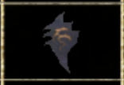

3、黑皇剑：单手武器，砍伤刺伤均不俗，各项能力超平均值，适合单手新手使用，黑色的外形看起来略为霸气（黑暗骑士八大配件之一）

4、暗炎盾：黑皇剑的配备品，朱红目前最强盾牌之一（应该可以排名第二），耐久度高，抗压抗打，唯一缺陷就是面积略小于龙盾黑色外形霸气，符合黑暗领主高冷的霸气外表（黑暗骑士八大配件之一）

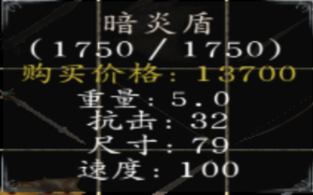

5、黑暗嗜杀者：与龙骑矛分庭抗礼的另一大陨铁骑枪（虽然在大部分玩家眼里略逊于龙骑矛），霸气的黑色外观也吸引了不少玩家（比之龙矛缺乏破格档并且不能挥砍，速度也略慢了些），（黑暗骑士八大配件之一）

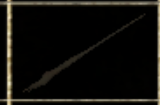

6、乌阙：作为整个朱红里面评价两极分化最为严重的武器之一，双手钝伤武器，其缺点在于过于笨重（那挥砍速度......并且重心不稳（即无法立即格挡）），并且由于在黑暗骑士手里伤害过于恐怖而被称为“孤儿武器”（黑暗骑士八大配件之一）

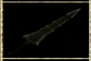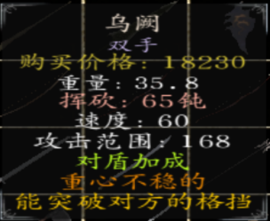

7、双月画戟（双月斩）：外表酷似方天画戟（无独有偶，只有公主不杀师击败戴安娜后才能获得的极品武器双月·魅斩也很像），伤害不俗，且属于骑枪长矛均可用的一种双配，而成为部分玩家及三啸本人的武器

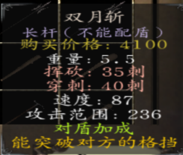

8、银蛇剑（银蛇之吻）：外表极为酷炫的一种双手武器（金蛇之吻无法制作，但比较银蛇属性更好），战斗力不俗，且公主开局为大师兄的武器，在反骑兵与骑兵；对付重甲/轻甲方面均能有建树

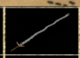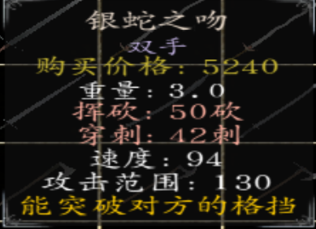

9、圣锤：格斗锤的升级品，近战能力贼强，也是陨铁武器里唯一单手钝伤（还达到40了），挥砍速度较

快，范围较近，适宜贴脸，NPC杀人利器

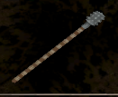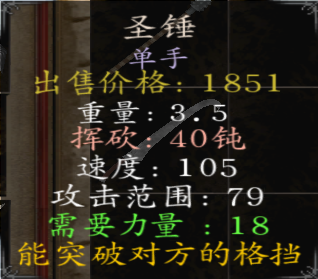

10,吴钩，刺伤武器，无力量要求，前期好用，又快又♂长，可带盾可挥砍，无刺动作，骑马左右砍很顺手，伤害虽低但♂快啊！

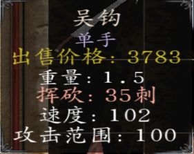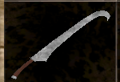

11,审判者（这个属性勉强看吧,没有贴图图片，勉强看）

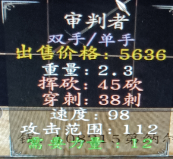

二：远程武器

1.  精灵长弓：步射最强刺弓，精度速度伤害均极为不俗，暗紫色的外表给人以致命的感觉，唯一的缺陷就是无法在马上用

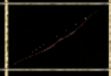

2.  仁慈之翼：马上用的钝弓，伤害不俗，精度速度极高，外观华丽，适合仁慈圣主配套使用

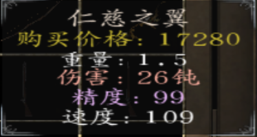

3.  汉王烈弓：被大砍一刀的骑弓（因为蒙古人也用），难度高了就是给人刮痧（不痒不痛），并不推荐自己制作（亡灵档可以从感染的16NPC身上拔）

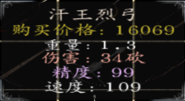

4.  最后的轻语：穿甲箭，10攻击力不是盖的，弹药量不少，适宜伤害流打法

5.  练习箭：懂得都懂不做解释（解释就是弹药量极为充足因此得到喜爱）

6.  精品标枪：16枚标枪，弹药量足够（但无法补充），伤害不俗（但不是很建议浪费陨铁，如果真想用就去扒大师兄的装备）

7.  诸葛连弩：打造的秘银连弩，战斗力极为不俗且为连弩，秘银外表极为炫酷（但不能在马上用）

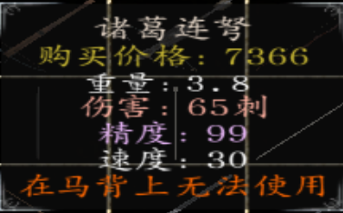

8.  梅花镖：玫瑰标枪的替代品，杀人补给，伤害不俗（不要带两个及以上，不然会出现bug）

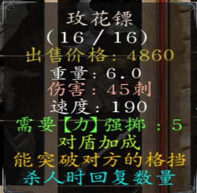

9、战姬弩：新加入的可以在马上用的弩，伤害不俗，有着与诸葛连弩相同的外表，唯一的缺陷是无法连发（一次两根）

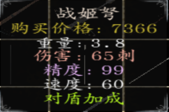

10、破甲钢弩箭：与另一个版本不同，这个弩箭可以穿透盾牌，杀伤力极强，建议配合战姬弩or诸葛连弩配套使用

三：盔甲与马匹

1.  银甲套装：三个陨铁换得，卡拉德女将必备，白天时30％几率免疫远程攻击

2.  金甲套装：五个陨铁换得，黄金女武神与卡拉德黄金女将必备，白天时50％免疫远程攻击

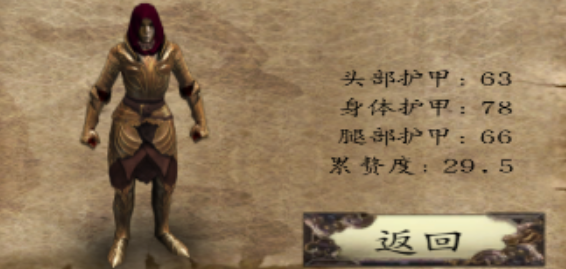

3.  黑暗套装：五个陨铁换得，黑暗兵种必备，晚上时60％免疫远程攻击

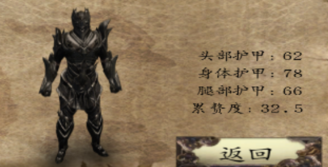

4.  银甲战马：一个陨铁＋一个骏马换得，卡拉德女将系列必备

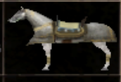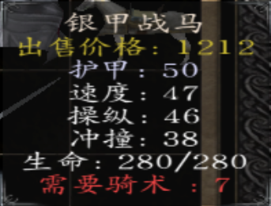

5.  黑暗战马：一个陨铁＋一个猎马获得，黑暗系列必备

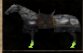

下面就没有了，学业原因，大部分问题没有写入，不过影响不会太大，如果有改进啥的，可以自己改了传群，谢谢啦

By-不只会水群的屑

