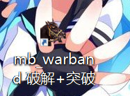
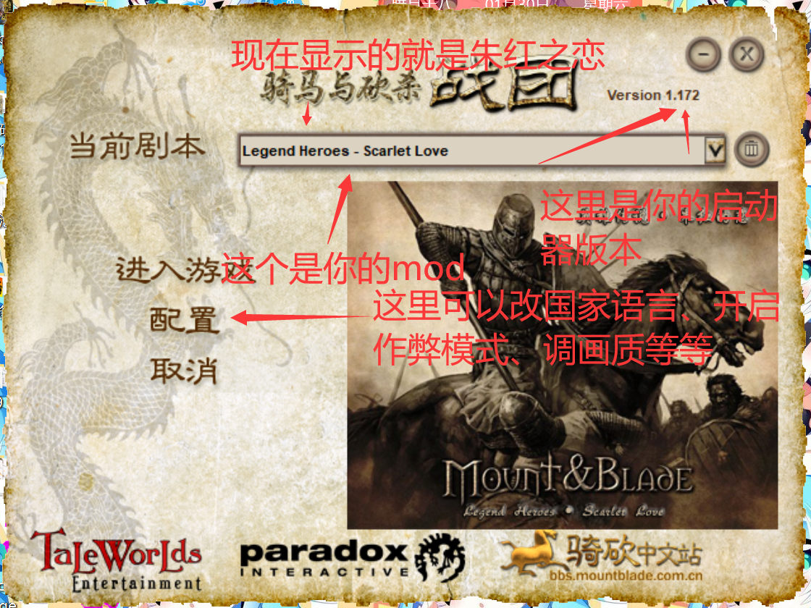

# 打不开朱红怎么办

::: info 来源说明
本页由上传的攻略文档 `打不开朱红怎么办？请看这里.docx` 自动转换为 Markdown。图片已提取到站点资源目录；如发现排版错位，建议在本页基础上人工校对。
:::

如何把朱红放置到可以玩的程度

1.  你的朱红，第一次下载好，你先点开文件夹康康里面是不是还有一个文件夹，里面那个才是有效的；

2.  正确使用方法：

找到这个文件夹，后面是日期可以不用对上但前面一定要对上

点开以后找到这个文件夹

把我刚刚说的有效的文件夹丢进modules文件夹里去，再打开你的启动器

（背景图不用理会）

好的，你就可以玩朱红了，你的登录背景应该是这样

