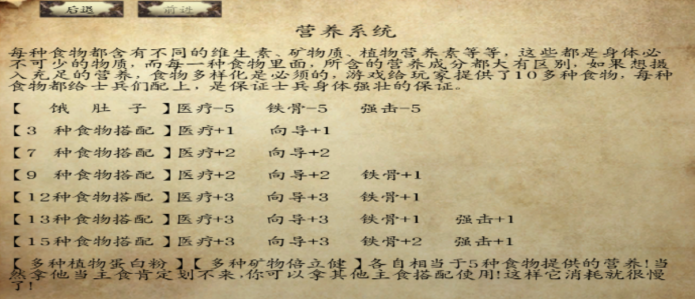
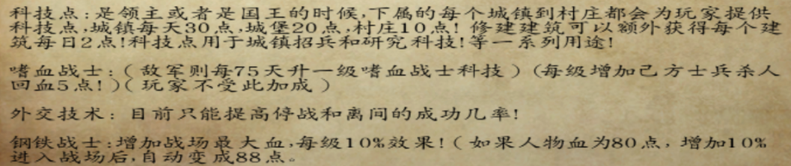
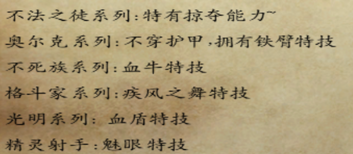
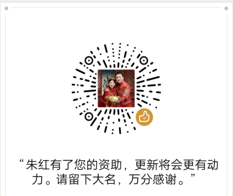

# 关于朱红的萌新问题

::: info 来源说明
本页由上传的攻略文档 `关于朱红的萌新问题.docx` 自动转换为 Markdown。图片已提取到站点资源目录；如发现排版错位，建议在本页基础上人工校对。
:::

1.  关于朱红的萌新问题

<!-- -->

1.  （亡灵档）母体：这是亡灵档的核心，同时也是亡灵档玩起来的快乐之处，你可以利用你的小兵提升自己的母体等级，也可以降一级提升不死族所有领主关系，母体30级并且做完武士甲任务可以挑战夜莺中队（猝死警告与废档警告），45级墓地可以刷出恐怖军团（帮助你守护村子）；每十级获得一个暴君种子（给NPC则将NPC智力削为0，技能点也相应降低，但是智力会分散到力量与敏捷上，同时该NPC受母体增益更高）。本modNPC＋几位国王里面除了辣条均无法感染（包括五匪首在内，因此不要想什么感染公主之类的事情）

2.  （公主档）杀师还是不杀师：这是公主档最大的分支，它决定了你的两种路，如果你是直面流你只能打一种（能修改代码、复制存档的当我没说）；不直面的可以双选。

    主要差距：杀师后师徒四人死亡，获得免费城堡德其欧斯堡（没有驻军），同时颜君入队，三大会战全部失利，公主会跳崖，三啸剧情会开启（简单来说杀师档剧情比不杀师长且难）

    不杀师可以获得可换装的师徒四人，德其欧斯堡会有95守军（在杀师中由朱坤带领来打你），颜君不会入队，三大会战胜利，有领主带着城池投靠你，不死族剧情可以让大师兄单挑龙玉获得魂之·挽歌

3.  杀师：这是朱红公主主线剧情，你将依次杀掉大师兄，三师兄，要离，获得冷血性格，孝悌忠信的性格废除（这两种性格对应能力下面有），一周后杀掉二师兄，后面的剧情会变长，同时会出现作者本人：三啸；

4.  不杀师：这是非主线剧情，短得多，简单得多，获得称号：义深情重（无效果，但是是后期法师任务必备，法师支线任务只有不杀师才能完成全部升级），三啸出现但雨女无瓜。

5.  陨铁：这是朱红的特色之一，是你战场上杀敌时累积陨铁碎片，积攒到一定数量可兑换成陨铁的一种算法，陨铁可以升级武器、马匹、盔甲；同时也可以打造武器，多个陨铁打造成一套盔甲，并升级骏马和猎马为光明战马和黑暗战马（请不要升级你的弹药筒）

    6、问题：1、魂之·挽歌在当下版本只有大师兄和龙玉二人使用挽歌有顺势斩；2、关于公主开局问题：公主开局只能带八个人，到你做完师傅系列任务（杀完师成为领主后）恢复正常带兵数，同时记住雇佣军不占格子但是工资量会随着同一种佣兵的增加而增加。3、统领技能：系统会根据你的战斗方式（步战步射骑射骑战）分别增加你的对应的统领等级，对应的等级能给对应的兵种（如英雄等级给NPC增加）增加相应的攻击力防御力之类（具体可以在报告中的个人信息查看）

    7、蒙古问题

    公主档：解决完黛安娜后出现（没事不要灭国库吉特，留两座城市免得出事，杀师档暗黑特工队最好也选诺德和维吉亚免得问题大，此时维吉亚和诺德基本在和丝袜开干）

    亡灵档：（龙玉入队后达到一定时间自动出来）

    8、四国之乱：这是目前公主版本的终点（有始无终），四国的部队都是最精英的（维吉亚——海外征服者（火枪体系求你锤死我）；诺德——尸化（双倍血量你快乐了吗），全部变成丧尸；罗多克——邪教大军（猎马者），萨兰德——驯兽师（感受到魔兽的快乐了吗）

    9、关于东瀛士兵：东瀛士兵是目前正在考虑的一个剧情，群里想象力丰富点的群员也帮忙想一下早点帮助啸哥赶出来我们也好玩

    10、关于AI：咖啡同意给了三啸部分AI：（加强了射手AI 骑兵AI 骑射AI，骑射AI还有君悦大大的备用AI）因此当下版本AI智商变高，高难度选择请谨慎

    11、贴身兵种系列：人类NPC点统御技能，会招募对应的贴身部队，贴身部队步战/骑马取决于招募他的NPC，而能力值也会增强（和魔兽一样死了只要对应的NPC不死就可以下一局刷新）

    12、另外，NPC与士兵的能力值受到营养系统的影响：（所以你的铁骨和强击下降记得看看是不是没吃的了？）

    

    13、最大血量上限：NPC每级获得20％额外血量，而主角则每做一个任务获得1％额外血量上限（可和科技叠加，主角本人拿不到血牛）

14、科技：

15、兵种特色：掠夺能力：杀人得钱，得到的数量与自己的掠夺等级成正比

铁臂：初始10％免伤，每级1％免伤能力，可与铁骨叠加

血牛：兵种双倍血量

疾风之舞、血盾、魅眼：不变

18、杀人涨属性：NPC与主角杀一定数量的敌人就能4种属性各涨1点，杀人数与智力成反比（具体算法：玩家的量：第一次是（力敏魅三者的和-智力＋30）×1.5＋100（商人档第一次为150，即最低150）；此后每一级都是（上一级杀人数＋力敏魅-智力）x1.5＋100；NPC的量：第一次是（力敏魅三者的和➖智力＋30）×1.2；此后每一级都是（上一级杀人数＋力敏魅-智力）x1.2＋30（其实具体多少不用自己去算，你只需要知道加智力可以减免杀敌涨属性即可）

19、守城新特色：

20、特殊兵种的招募方法：（1）、卡拉德黄金女将与光明系军种：玩家为卡拉德的领主，在获得城镇/城市的封地后建造训练场/学校然后升级，可以利用城堡提供的招兵点升级对应军种为这两种军队。

2.  、黑暗军种：公主杀师可以在完成黛安娜剧情后找三啸用丝袜皇家骑士升级为黑暗骑士，比例为1：1；不杀师则有暗灵石（战场自动提供）

3.  、蒙古军种：问阿喇海别可以招募（在阿喇海别入队后和黄金女将一个招法）

4.  、卡洛斯军种：公主招募三啸三杰（哼哈、玛雅、奥尔克）的最高级军种后在自己城堡招募（和黄金女将一个招法）

5.  、驯兽师、罗多克邪教军队：俘虏招募

6.  、海外征服者：可通过俘虏招募（但当下这类兵种会定期自动清理，因此能在清理之前招募到算你的运气）

    21、朱红的火枪：只有一把你可以用，火枪燃烬，20级时在营地扎营有选项，（异国商人提问）答案附图：（请数字数）

22、敌人的科技：（一般而言，难度越高科技升级越快，且敌人科技点无上限）  
（敌人升一级科技时间对应  
三神模式       9.375天——准备好你的肝  
天神模式       12   天  
地狱模式       18.75天  
恶梦模式       37.5 天  
正常模式       75   天  ）
