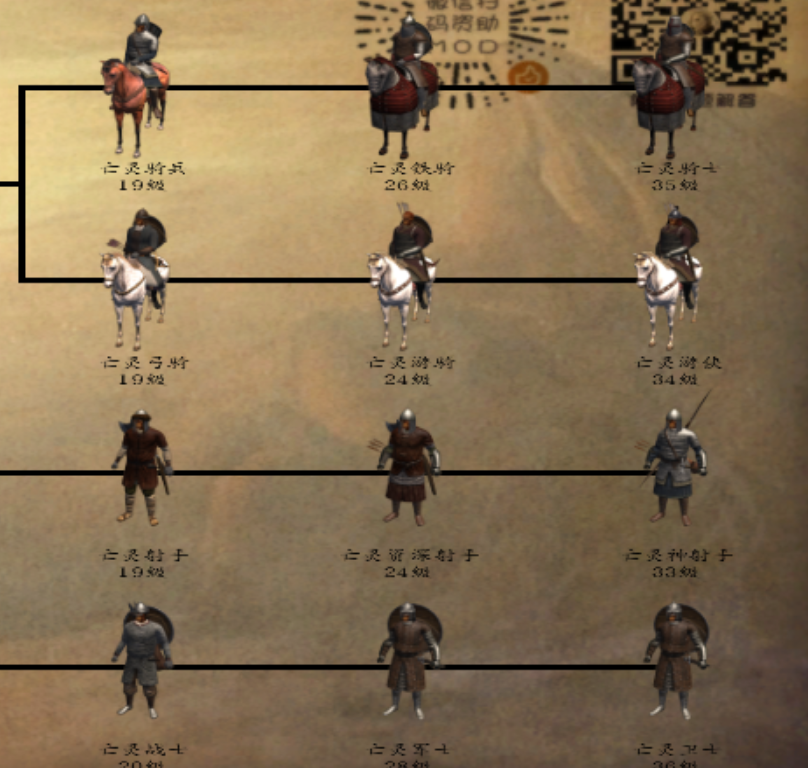

# 萌新攻略：亡灵篇

::: info 来源说明
本页由上传的攻略文档 `萌新攻略：亡灵篇.docx` 自动转换为 Markdown。图片已提取到站点资源目录；如发现排版错位，建议在本页基础上人工校对。
:::

亡灵攻略：（简单攻略，简单一词和公主一样）

提供亡灵感染的算法：感染一个士兵，成功几率＝母体等级/（母体等级+你想感染的士兵等级），也可以抓了在营地感染，几率一样（如果点传播病毒没有反应那就是你一个兵都无法感染成功，也就是母体等级太低，想感染士兵等级过高）

开局只有两个破NPC，啥都没有？不你还有把匕首和一根木棍（记住先肝母体等级再屯兵，如果可以吃点高级兵这样等级提升的快）

亡灵剧情我先透露：1、龙玉与卡门的恩恩怨怨（唯一且短的老火的主线）；2、东周训练场的神秘的礼物；3、夜莺中队的过去与将来；4、蒙古入侵；

首先，亡灵虽然有剧情，但大体还是沙盒，因此开局先去找22个箱子＋武士甲（找齐武士甲后用你一级的躯干随便烧一个村子刷阿修罗），同时会刷出一个NPC辣条全图追杀你（你与所有势力关系为-100除不死族外），刷出来就杀了（如果难度高了，比如天神，过半天他的队伍全是高级兵），可以养猪（不用手术刀干掉他有几率让他不入队，刷新更好的装备与更高等级（最高级是豪华银甲套））也可以直接杀掉获得辅助级别的人物（早期最强辅助）。同时刷五印（顺序海贼---绿林---草原---沙漠和山贼顺序自选），这样掠夺能力高了，野怪等级高了，刷兵刷钱都来得快

20天左右获得“神秘的礼物”，去东周训练场带上NA NC二人三打四（师徒四人），记得给他俩准备点好装备（我当时打的时候两人都有一个陨铁装备），打赢后获得玫瑰标枪＋师徒四人（分别培养，沙尔走智力流，朱坤走敏捷流，孙宇走力量流），再把金蛇与杀马特找了然后去找龙玉开始接任务，同时可以考虑感染16NPC了，利用村战事半功倍

60天左右五印至少有三印了，然后母体到达30级，16NPC如果感染超过4个就可以去交接武士甲任务（我相信你做了）晚上去打夜莺（猝死警告？废档警告？），打赢用村雨刃替代金蛇，同时获得战斗力极强的13夜莺武士（战斗中死了那么结算后自动补充，十三妖的数量是不会减少的）

100天左右可以考虑把龙玉任务做完（单挑，感染光明系10个，找卡门单挑并除掉卡门），然后在母体到达45级左右可以去接手了（母体45级乱葬岗建了墓园以后出现恐怖军团守村子）

接手亡灵就感染城里所有丝袜军，屠城，把丝袜军全部感染吃了，然后抄家伙直奔库吉特，砍的只留一座城市下来给蒙古入侵做准备，没事就把领主痛打一顿（最好再给感染了增加主力军领主）

160天左右打完库吉特，开始屯兵（打完蒙古就去找黛安娜耍耍）

接下来还要？母体50级基本开张了都？（母体先给要离再给龙玉然后孙宇朱坤然后16NPC分着给，但是三个智勇（亚提曼沙尔辣条）别给）

同时给一点本人的想法与技巧：

1.  五印一定要早期刷，中期没时间的；

2.  三啸联盟军一带不要去（三啸本人15侦察15向导跑起来跟开了幽灵疾步一样），库吉特一带尽量不要去（库跑跑还是快的，当然辣条入队后可以去，因此尽量把草原印放在第四第五个刷）

3.  夜莺战斗力不俗，因此打之前做好十二分准备

4.  烧村尽量挑偏远的地方免得被抓住（被领主抓住基本上是没有活路的）

5.  母体种子一定不要给辣条亚提曼沙尔这几个智勇技能，可以考虑先给要离、孙宇、朱坤三人，同时给龙玉留一个种子

6.  开局烧村后得到的战利品可以选择收起来，存到22个城镇的箱子里（乱葬岗能卖但是村长手里一般没多少钱），等你打下了一座城市，屠城以后，就可以卖了

7.  亡灵开局抢钱就依靠烧村子和抢劫商队，烧村子找诺德窝车则左边那座村子（地图最上方）与乱葬岗左边那座村子（就是喊你去打魔兽的那座村子，有一定危险）与地图右上角那座维吉亚村子（风险性比较小但还是有风险）

8.  亡灵开局就把阿修罗刷了，利用烧村里此时村里全是村民的这一特性轻松刷得

    9、开箱子可以考虑养猪起来的辣条（黑甲、硬皮甲、豪华银甲、不错的装备）

    10、亡灵无头兵种获得方法：后三列兵种被爆头出（分别对应濒危骑士、濒危游骑、濒危神射手、濒危卫士）

11：亡灵系的bug：建造墓园以后不出军队（地图上亡灵游走军队太多或者等级太低，因此建议提高个人能力）

12、亡灵没有四国之乱（暂时没有）

13、亡灵的快乐就是烧村烧村and烧村，没有地狱使者不配当合格的亡灵（善良的亡灵当我没说），同时亡灵不要做什么仁慈圣主，那玩意抽风的亡灵才去做（你俘虏招进来干嘛？不如直接感染；统御有用？T病毒加的不够多？），当然如果你觉得仁慈好做了也无妨。

14、卡门不出来就直接去城镇对话一样的效果（杀卡门任务时）

15、如果你感染了NPC却没有解决他的部队，那么他的部队会游走，并且他还是领主会定期获得经验（偷着乐去吧你），同时切记不要感染第二次，任何NPC感染第二次会变为一级的能力
