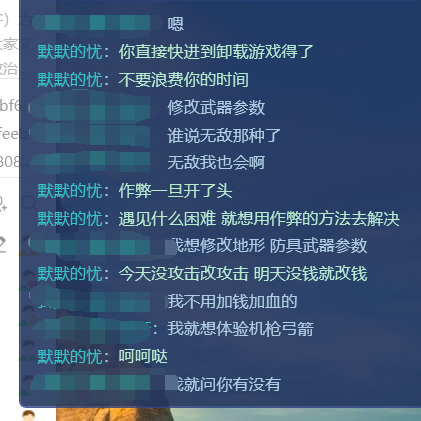

# 作弊须知

::: info 来源说明
本页由上传的攻略文档 `作弊须知.docx` 自动转换为 Markdown。图片已提取到站点资源目录；如发现排版错位，建议在本页基础上人工校对。
:::

1.  一旦选择了导入导出和魔球改变自身的能力值，你就只能玩简单模式了（不动自己的能力还是可以的）

2.  除了简单模式，其他模式ctrl看运气（飞天可以用三次），魔球和导入导出一次死

3.  你的魅力会关乎场上你的兵的生命值和最后一个敌人的生命值（魅力高一点生命值高一点），因此魅力太高会导致敌人最后一个敌人生命过高，请谨慎使用；智力过高会导致打仗获得经验过多升级太快，也请谨慎

4.  尽量不做弊才能体会到最好的游戏感

5.  附上三啸的一段话：

    为啥作弊玩家发的意见建议什么的，我基本上都不听。  
    人家几千行代码，写的骑射AI，结果他战场上直接艾弗斯将军秒全屏。几千行代码写的经济系统，他直接就康秋+x刷钱。作弊玩家没有尊重作者的劳动成果，所以作者也不喜欢为作弊玩家废什么精力

    6、友情提示：请不要把你的力量刷过63以免系统给你来一记误判到时候别去群里炮轰（来轰你看我轰不轰你就完了嗷）

    （超过63绝对有小屁孩杀人的）

    7、附上我某日看虎牙默默的忧（主播，骑砍技术玩家）直播时他和粉丝的对话（警醒作弊者）：（当然如果是为了图快乐那就另说）如果真想作弊，个人建议去低难度（比如正常简单，正常模式我测试下来对作弊很宽容），

    
