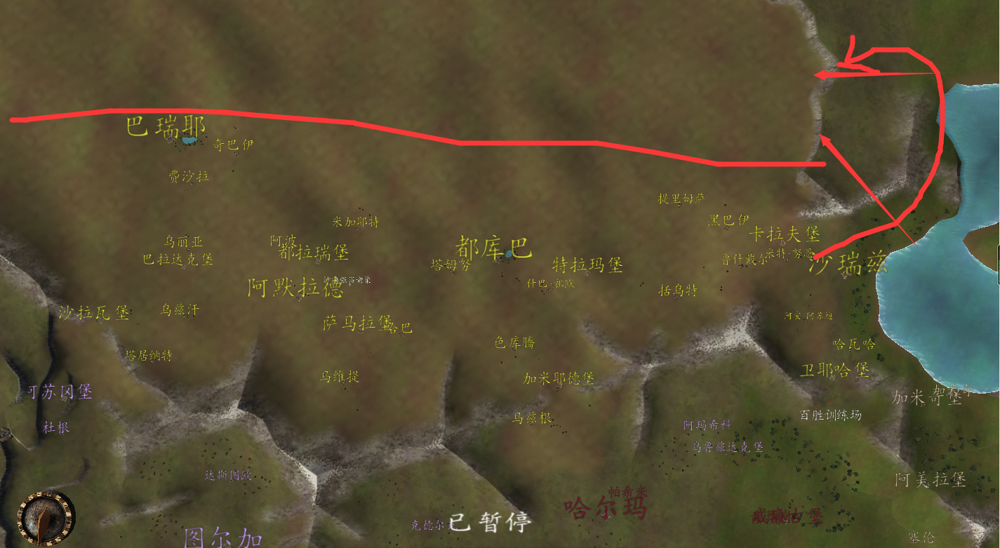

# 沙漠强盗

::: info 来源说明
本页由上传的攻略文档 `沙漠强盗.docx` 自动转换为 Markdown。图片已提取到站点资源目录；如发现排版错位，建议在本页基础上人工校对。
:::

沙漠强盗找不到问题

首先我们了解朱红的一个野怪特性：如果野怪数量超过一定数量（在7-10左右）便不会再刷，而沙漠强盗可能刷在了红线标着的沙漠后半截，由于空气墙的缘故玩家是无法直接进去的，进去的方法是我右边划线的箭头进去

在里面可以找到沙漠强盗

如果找不到沙漠强盗就进去康康
