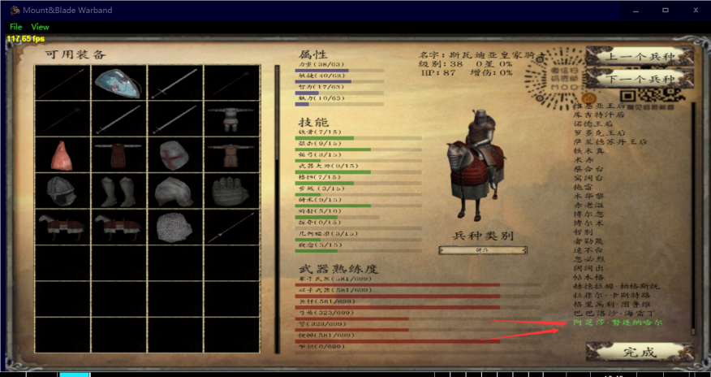
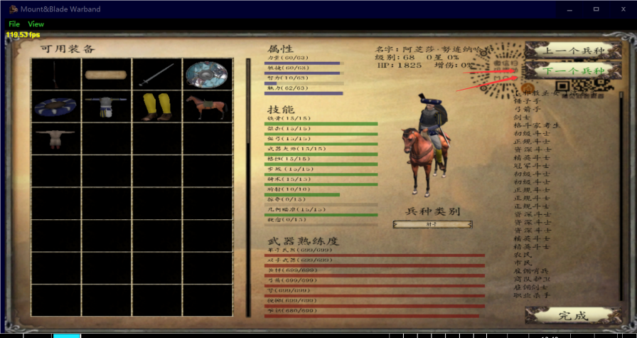
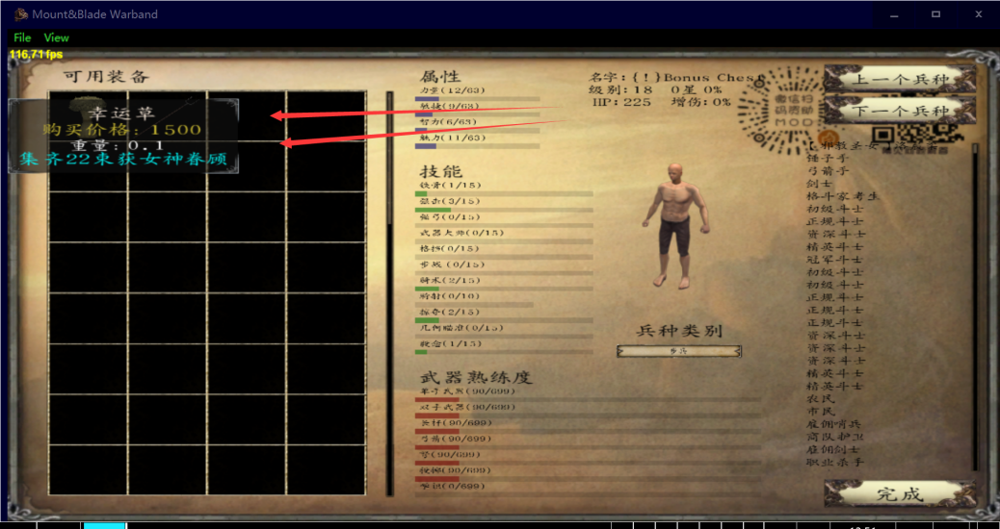

# 幸运草寻找方案（包括杀马特和金蛇）

::: info 来源说明
本页由上传的攻略文档 `幸运草寻找方案（包括杀马特和金蛇）.docx` 自动转换为 Markdown。图片已提取到站点资源目录；如发现排版错位，建议在本页基础上人工校对。
:::

现在你想看哪个箱子里有杀马特和金蛇，先打开你的兵种树（这两种神器在你20级后任意刷入两个箱子）

随便点一个兵种进入如下图所示的兵种树，再拉到最底下，点击这个人

然后疯狂点下一个兵种

等你出现幸运草的时候说明已经翻到了箱子一栏

接下来，你可以用这种方法去判断哪个箱子的幸运草没拿、每个城市的商人在卖什么、杀马特和金蛇在哪个箱子里（具体每个箱子里对应的物品等我慢慢做）

同时记住，你可以在这里看所有NPC的状态

https://tieba.baidu.com/p/6620345972?share=9105&fr=share&see_lz=0&sfc=copy&client_type=2&client_version=11.3.8.2&st=1586960799&unique=4D4F77278249A042634766D7E950F8BC&red_tag=1990192505

这个链接是百度贴吧的，可以复制粘贴这个链接去看所有箱子的位置

https://www.bilibili.com/video/BV1Ut411B7nE?from=search&seid=11841019649475539371

这个链接是b站三啸的（可以选集）

日瓦丁：练习箭，练习弓，练习靴，练习骑枪

日瓦车则：硬弓/奇型甲，奇型短刀  
库劳：双手斧  
库丹：毛皮\*2  
窝车则：连衣裙\*2  
萨哥斯：耙子  
提哈：熏鱼/奇型盔，奇型长刀  
帕拉汶：手半剑，剑  
苏诺：平面骑兵盾  
乌斯豪克尔：工具\*2  
杰尔喀拉：夹板式皮护腿/奇型靴，奇型刀  
维鲁加：陶器  
亚伦：攻城连弩  
阿拉默德：萨兰德勇士盔  
巴瑞耶：萨兰德战斗斧  
都库巴：萨兰德链甲靴  
沙瑞兹：萨兰德皮甲  
哈尔玛：库吉特皮靴  
拉那：库吉特护盔  
图尔加：库吉特鳞甲背心  
艾车莫尔：库吉特弓  
卡拉德帝都：精锐匕首
