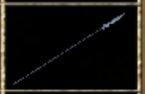
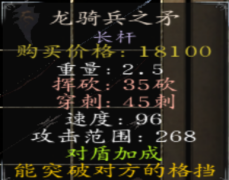
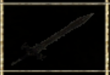
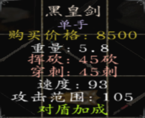
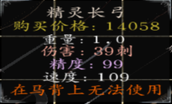
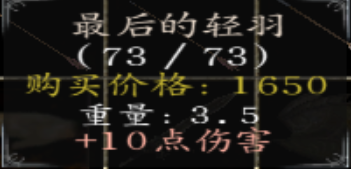
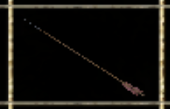
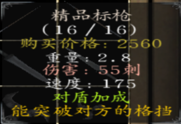
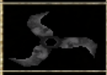
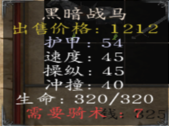

# 萌新攻略：陨铁武器篇

::: info 来源说明
本页由上传的攻略文档 `萌新攻略：陨铁武器篇.docx` 自动转换为 Markdown。图片已提取到站点资源目录；如发现排版错位，建议在本页基础上人工校对。
:::

陨铁武器个人评价（可能有偏差）：

1.  近战：

    1、龙骑兵之矛：这东西是骑战必备，破格档、刺伤高、冷色外形酷炫、黄金女将必备武器，实在符合公主玩家的需求，因此大部分玩家都喜好（作为骑枪，在马上不能挥砍）

2、龙骑兵之盾：龙骑矛的配备品，朱红里目前最强盾牌，冷色外形酷炫，耐久度高，抗压抗打，面积大，符合大部分玩家的要求

3、黑皇剑：单手武器，砍伤刺伤均不俗，各项能力超平均值，适合单手新手使用，黑色的外形看起来略为霸气（黑暗骑士八大配件之一）

4、暗炎盾：黑皇剑的配备品，朱红目前最强盾牌之一（应该可以排名第二），耐久度高，抗压抗打，唯一缺陷就是面积略小于龙盾黑色外形霸气，符合黑暗领主高冷的霸气外表（黑暗骑士八大配件之一）

5、黑暗嗜杀者：与龙骑矛分庭抗礼的另一大陨铁骑枪（虽然在大部分玩家眼里略逊于龙骑矛），霸气的黑色外观也吸引了不少玩家（比之龙矛缺乏破格档并且不能挥砍，速度也略慢了些），（黑暗骑士八大配件之一）

6、乌阙：作为整个朱红里面评价两极分化最为严重的武器之一，双手钝伤武器，其缺点在于过于笨重（那挥砍速度......并且重心不稳（即无法立即格挡）），并且由于在黑暗骑士手里伤害过于恐怖而被称为“孤儿武器”（黑暗骑士八大配件之一）

7、双月画戟（双月斩）：外表酷似方天画戟（无独有偶，只有公主不杀师击败戴安娜后才能获得的极品武器双月·魅斩也很像），伤害不俗，且属于骑枪长矛均可用的一种双配，而成为部分玩家及三啸本人的武器

8、银蛇剑（银蛇之吻）：外表极为酷炫的一种双手武器（金蛇之吻无法制作，但比银蛇好了几百个档次），战斗力不俗，且公主开局为大师兄的武器，在反骑兵与骑兵；对付重甲/轻甲方面均能有建树

9、战锤：格斗锤的升级品，近战能力不低，也是陨铁武器里唯一单手钝伤（还达到40了），挥砍速度较快，范围较近，适宜贴脸

二：远程武器

1.  精灵长弓：步射最强刺弓，精度速度伤害均极为不俗，暗紫色的外表给人以致命的感觉，唯一的缺陷就是无法在马上用

2.  仁慈之翼：马上用的钝弓，伤害不俗，精度速度极高，外观华丽，适合仁慈圣主配套使用

3.  汉王烈弓：被大砍一刀的骑弓（因为蒙古人也用），难度高了就是给人刮痧（不痒不痛），并不推荐自己制作

4.  最后的轻语：穿甲箭，10攻击力不是盖的，弹药量不少，适宜伤害流打法

5.  练习箭：懂得都懂不做解释（解释就是弹药量极为充足因此得到喜爱）

6.  精品标枪：16枚标枪，弹药量足够（但无法补充），伤害不俗（但不是很建议浪费陨铁，如果真想用就去扒大师兄的装备）

7.  诸葛连弩：打造的秘银连弩，战斗力极为不俗且为连弩，秘银外表极为炫酷（但不能在马上用）

8.  梅花镖：玫瑰标枪的替代品，杀人补给，伤害不俗

9、战姬弩：新加入的可以在马上用的弩，伤害不俗，有着与诸葛连弩相同的外表，唯一的缺陷是无法连发

三：盔甲与马匹

1.  银甲套装：三个陨铁换得，卡拉德女将必备，白天时30％几率免疫远程攻击

2.  金甲套装：五个陨铁换得，黄金女武神与卡拉德黄金女将必备，白天时50％免疫远程攻击

3.  黑暗套装：五个陨铁换得，黑暗兵种必备，晚上时60％免疫远程攻击

4.  银甲战马：一个陨铁＋一个骏马换得，卡拉德女将系列必备

5.  黑暗战马：一个陨铁＋一个猎马获得，黑暗系列必备

