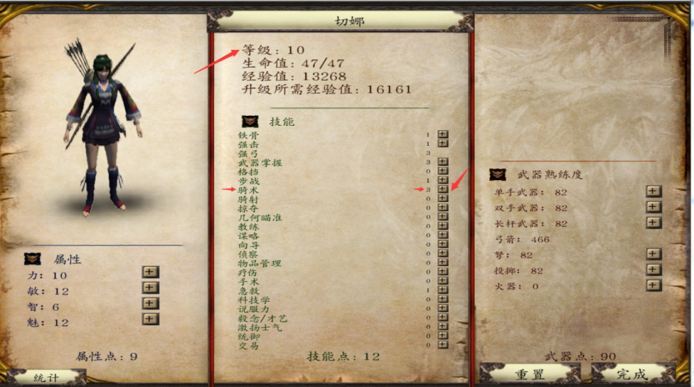
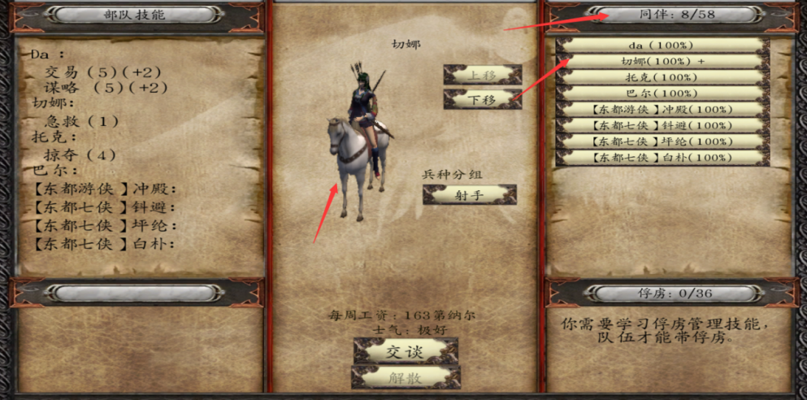
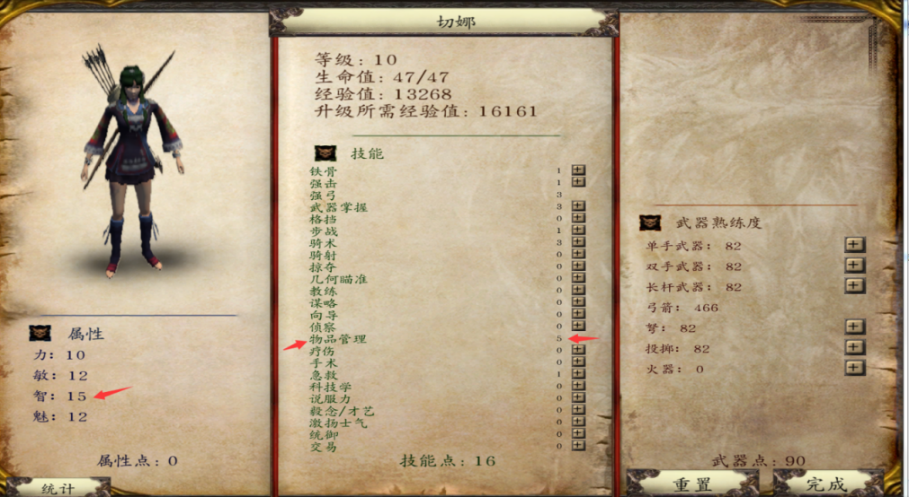
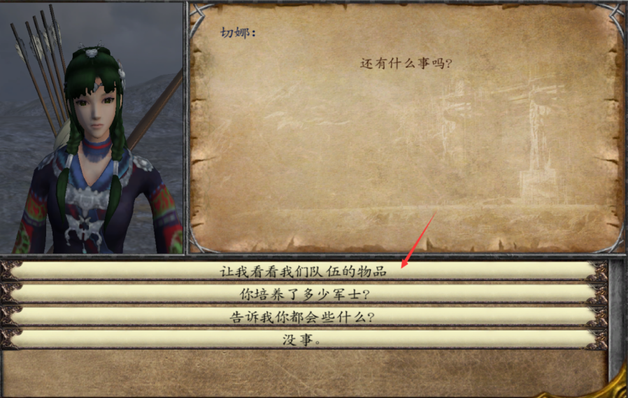
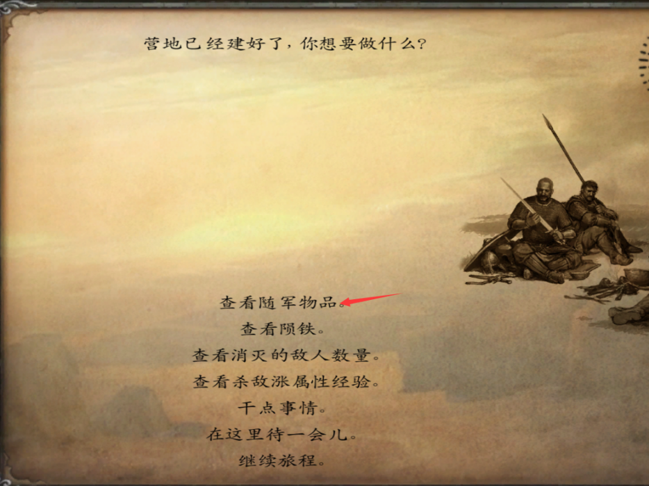
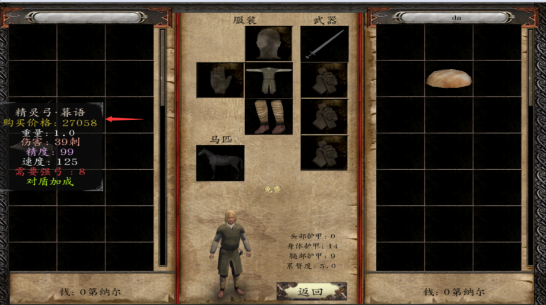
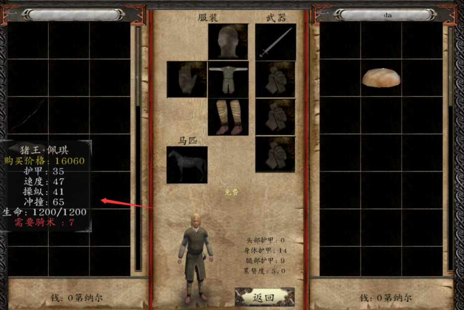

# 开箱子问题

::: info 来源说明
本页由上传的攻略文档 `开箱子问题.docx` 自动转换为 Markdown。图片已提取到站点资源目录；如发现排版错位，建议在本页基础上人工校对。
:::

公主杀师傅与商人档专属彩蛋福利

第一步：观察切娜等级与属性（强弓低于8骑术低于7）

第二步：看切娜是否骑上骏马背着正常弓；

第三步：给切娜的物品管理点到5  
 

第四步：与切娜对话如图所示

第五步：查看箱子（可从对话界面或营地中）

第六步：拿走你想要的极品武器（暮雨弓与佩奇）

这个方法可适用于除萨尔翼和无法入队的NPC外的所有NPC
