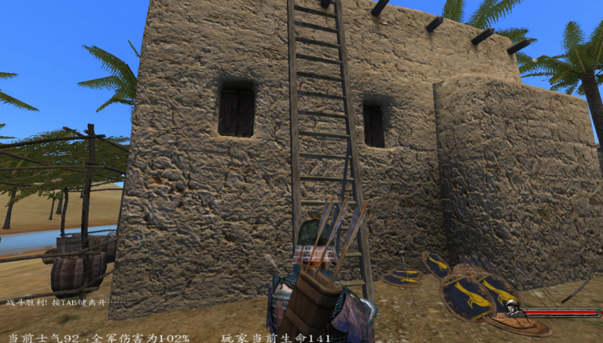
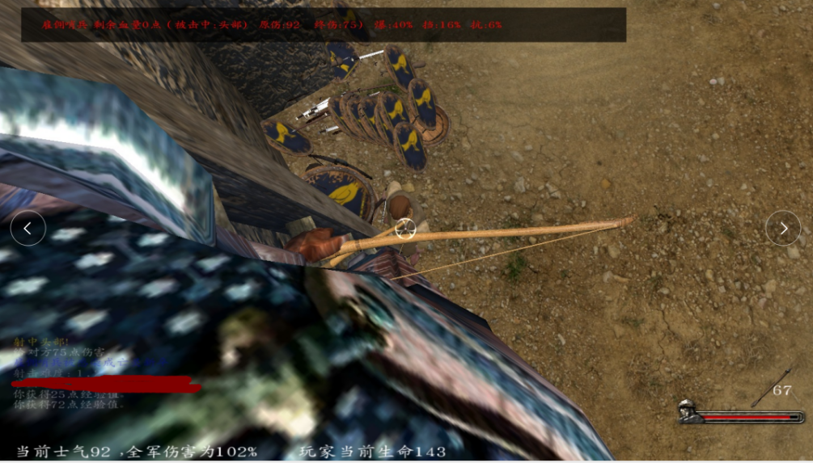
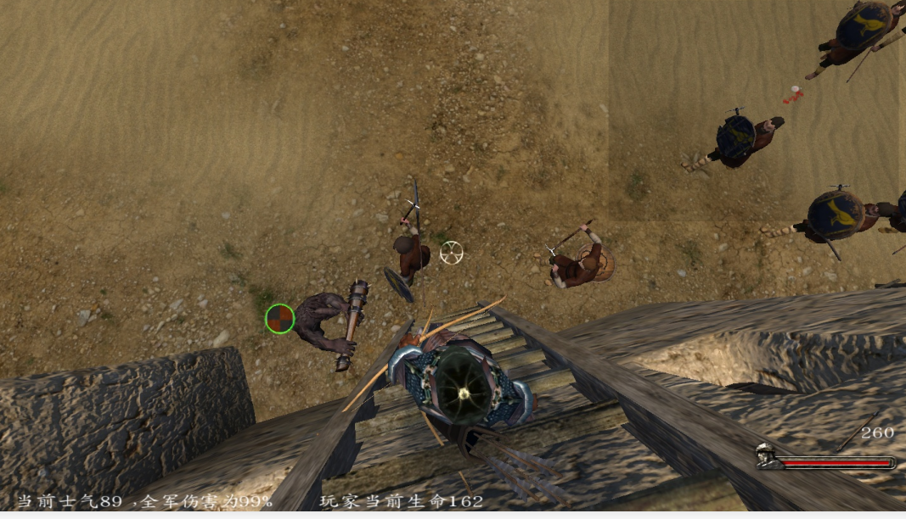

# 镇压村民专用村

::: info 来源说明
本页由上传的攻略文档 `镇压村民专用村.docx` 自动转换为 Markdown。图片已提取到站点资源目录；如发现排版错位，建议在本页基础上人工校对。
:::

亡灵当福利攻略可利用的BUG 地图上面的村子 马兹根  
  
 可以再楼梯上面无伤镇压农民 哪怕是顶级兵如图  
  
  
  
操作细节就是上楼梯的时候最好退上去，为了避免右边出来远程的会揍人不要爬太高
